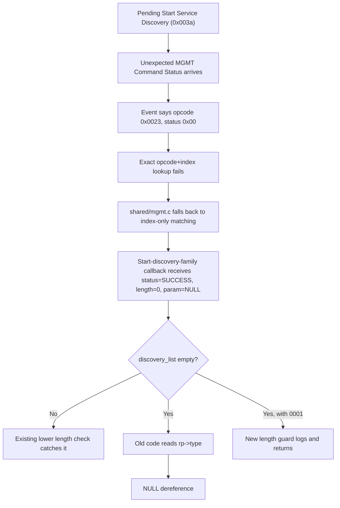
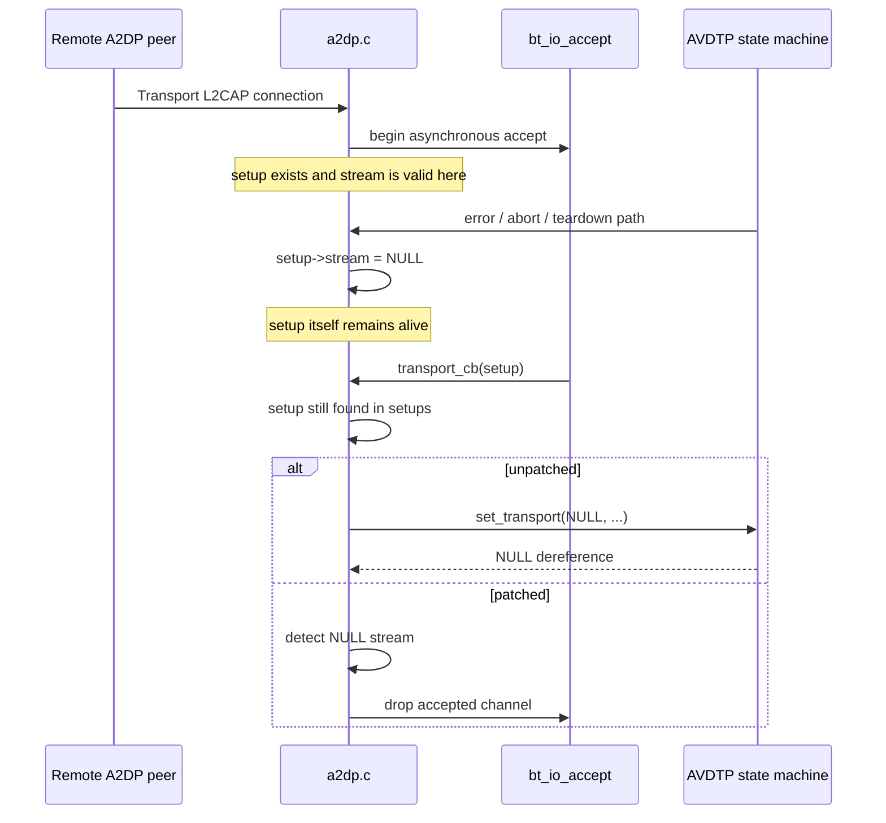

# Third-party review of the two BlueZ patches — 2026-09-18T07:00Z

**Source.** An independent reviewer, engaged by the operator before sending, working from
the public repository at `cccf0fe` and cross-checking against BlueZ master
`2401054ca67a1f79e44e71d6a1cea096a13f5e5d` (2026-09-17), the Linux management
implementation, and the historical commits the patches cite. The review is reproduced
verbatim in §"The review" below. Tokens of the form `fileciteturnNNfileNLx-Ly` and
`citeturnNNviewN` are the reviewer's tool's citation markers and carry no content; they are
kept rather than edited out.

**Verdict as given.** Accept both, submit independently; both defects present at current
master; `0002` stronger empirically; for `0001`, a "strong additional lead" on the untraced
trigger through `src/shared/mgmt.c`'s index-only request fallback.

**What this side did with it** is in §"Verification". In one sentence: the review is right
about both patches and about upstream state; its lead on `0001` rests on a label that was
**ours and wrong**, and re-reading the source log behind that label both refuted the lead and
reconstructed the crash the patch fixes, line by line.

Register: `reviews/README.md` §TP.

## Verification

Each claim checked here is followed by the command and its verbatim output, per the house
rule. Paths are relative to the repository; the BlueZ tree is the local unshallowed clone at
`c73fa2f9a` in `/var/cache/bt-investigation/bluez`.

### TP-01 / TP-02 — both defects present, both patches apply: confirmed

```console
$ patches/bluez/git-am-check.sh /var/cache/bt-investigation/bluez c73fa2f9a
git-am-check — bluez at c73fa2f9a
  PASS  0001 alone — git am clean, 1 commit(s) on top of c73fa2f9a
  PASS  0002 alone — git am clean, 1 commit(s) on top of c73fa2f9a
  PASS  0001 then 0002 — git am clean, 2 commit(s) on top of c73fa2f9a
  PASS  0002 then 0001 (order-independent) — git am clean, 2 commit(s) on top of c73fa2f9a
  PASS  no Signed-off-by in either patch
  PASS  subject 49 chars · subject 46 chars · no body line over 72

all 6 checks passed
```

Run after the `0001` message rewrite described under TP-03/TP-05. The reviewer's check was
against `2401054` (09-17), 60-odd commits newer than the local `c73fa2f9a`; the reviewer
reports the vulnerable constructs unchanged there. Not re-verified locally (no network fetch
from this environment); recorded as the reviewer's observation.

### TP-03 — the opcode label: the review inherited our error

The review says: *"The patch records an occasion described as a Start Service Discovery
callback while the debug message said `command 0x23 status: 0x00`. But `0x0023` is Start
Discovery, whereas `MGMT_OP_START_SERVICE_DISCOVERY` is `0x003A`."* Both halves are correct,
and the first is a defect in **our** record, not an observation about BlueZ:

```console
$ grep -n 'define MGMT_OP_START_DISCOVERY\|define MGMT_OP_START_SERVICE_DISCOVERY' \
    /var/cache/bt-investigation/bluez/lib/bluetooth/mgmt.h
304:#define MGMT_OP_START_DISCOVERY		0x0023
456:#define MGMT_OP_START_SERVICE_DISCOVERY		0x003A
```

`EX-041` line 72 labelled `command 0x0023` as `START_SERVICE_DISCOVERY`; the label was copied
into `patches/bluez/0001`'s message on 09-16 ("a MGMT_OP_START_SERVICE_DISCOVERY reply
delivered as …"). Corrected in `EX-041` (⚠️ block), the patch, `patches/bluez/README.md`,
BRIEF §6, README, `docs/issues.md`, and `mail-notes/0001.txt`.

### TP-04 — the index-only fallback hypothesis: refuted by the log

The review's chain: pending Start *Service* Discovery (`0x003A`) → Command Status names
`0x0023` → opcode+index lookup fails → `request_complete()` falls back to index-only
(`6efdbd8dbd16`) → the wrong callback receives `status 0, length 0, param NULL`.

The fallback exists exactly as described:

```console
$ git -C /var/cache/bt-investigation/bluez log -1 --format='%h %ad %s' --date=short 6efdbd8dbd16
6efdbd8dbd16 2021-06-04 shared/mgmt: Fix not processing request queue
$ sed -n 307,316p /var/cache/bt-investigation/bluez/src/shared/mgmt.c
	request = queue_remove_if(mgmt->pending_list,
					match_request_opcode_index, &match);
	if (!request) {
		DBG(mgmt, "Unable to find request for opcode 0x%04x", opcode);

		/* Attempt to remove with no opcode */
		request = queue_remove_if(mgmt->pending_list,
						match_request_index,
						UINT_TO_PTR(index));
	}
```

But it was not taken. In every logged instance the request sent immediately before was
`0x0023`, so the event's `0x23` matched it exactly, and the fallback's own debug line
(`Unable to find request`) never appears:

```console
$ grep -n -B1 'command 0x23 status: 0x00' evidence/sessions/20260814-212211-trial-stock-2-hang/bluetoothd.log | grep -c 'send_request() \[0x0000\] command 0x0023'
5
$ grep -c 'Unable to find request' evidence/sessions/20260814-212211-trial-stock-2-hang/bluetoothd.log
0
```

(Five: the four with-clients instances at 20:31 and the fatal one at 21:03:24/26; the 09-08
instance in the live journal has the same shape, `EX-041`.)

### TP-05 — the event is identified; the kernel's reason is not

`src/shared/mgmt.c` prints two different strings for the two completion events, in 5.72
(the running build) and at master alike:

```console
$ grep -n 'command 0x%02x status\|command 0x%04x complete' /var/cache/bt-investigation/bluez-build/bluez-5.72/src/shared/mgmt.c
391:		DBG(mgmt, "[0x%04x] command 0x%04x complete: 0x%02x",
401:		DBG(mgmt, "[0x%04x] command 0x%02x status: 0x%02x",
$ sed -n 411,419p /var/cache/bt-investigation/bluez/src/shared/mgmt.c
	case MGMT_EV_CMD_STATUS:
		cs = mgmt->buf + MGMT_HDR_SIZE;
		opcode = btohs(cs->opcode);

		DBG(mgmt, "[0x%04x] command 0x%02x status: 0x%02x",
						index, opcode, cs->status);

		request_complete(mgmt, cs->status, opcode, index, 0, NULL);
		break;
```

So `command 0x23 status: 0x00` **is** `MGMT_EV_CMD_STATUS` with status success, and that
branch passes `length 0, param NULL`. The crashing daemon's last management lines, and the
kernel's record of its death:

```console
$ grep -n '\[2821\]' evidence/sessions/20260814-212211-trial-stock-2-hang/bluetoothd.log | tail -3
4811:Aug 14 21:03:24.943018 n bluetoothd[2821]: src/shared/mgmt.c:send_request() [0x0000] command 0x0023
4812:Aug 14 21:03:26.994468 n bluetoothd[2821]: src/shared/mgmt.c:can_read_data() [0x0000] command 0x23 status: 0x00
4813:Aug 14 21:03:26.994484 n bluetoothd[2821]: src/adapter.c:start_discovery_complete() status 0x00
$ grep -n 'discovery_remove\|start_discovery() sender' evidence/sessions/20260814-212211-trial-stock-2-hang/bluetoothd.log | tail -2
4801:Aug 14 21:03:16.475347 n bluetoothd[2821]: src/adapter.c:start_discovery() sender :1.125
4804:Aug 14 21:03:16.750850 n bluetoothd[2821]: src/adapter.c:discovery_remove() owner :1.125
$ grep -n 'segfault' evidence/sessions/20260814-212211-trial-stock-2-hang/timeline.txt
20116:21:03:26  KERN  bluetoothd[2821]: segfault at 0 ip 00005d6eb1ad1986 sp 00007ffef8e784b0 error 4 in bluetoothd[a6986,5d6eb1a50000+f3000] likely on CPU 8 (core 4, socket 0)
```

Client list empty from 21:03:16; Start Discovery sent 21:03:24.943; Command Status success
2.05 s later; the callback runs the no-clients branch with `rp == NULL`; `segfault at 0` at
the instruction the crash-site analysis resolved to `cp.type = rp->type`. The reviewer's
recommended wording — do not assert that current Linux normally emits a successful
parameterless Command Status — is honoured in the opposite direction from the one intended:
the message now states that it **did**, six times on this machine, and that why is not
established. The 37 other Start Discovery completions in the same log are ordinary
one-byte Command Completes:

```console
$ grep -c 'command 0x0023 complete' evidence/sessions/20260814-212211-trial-stock-2-hang/bluetoothd.log
37
```

Timing of the abnormal six: 12–14 ms after the send for the five with clients; 2.05 s for
the fatal one, during the controller's HCI command timeouts (`0x0406 tx timeout` every 2 s,
20:32:21 → 21:03:26, `timeline.txt`). That correlation is noted, not asserted as cause.

### TP-09 — the raw management trace the review asks for

The 08-14 session's `hci-captures.txt` names three `btsnoop` files from `bt-trace`; those
rotated out weeks ago. But `bin/bt-capture`, the decode-free writer that runs beside
`btmon`, kept its own files under `/var/log/bt-health/capture/`, and
`hci-20260814-201826.btsnoop` spans 20:18:26 → 21:44:02 — both the 20:31 instances and the
21:03 crash. It has been read. The management channel is in it, the reply the kernel sent
is in it, and so is what the kernel was doing when it sent it.

That reading is **kernel-side material, and it is held with its patch** — this project's
practice for any kernel finding is that the report and the fix travel together, so neither
the decoded capture nor the source analysis is in this file. What can be said here: the
reviewer's instinct that the trace would settle the question was right, and the answer is
not the index fallback.

### Checkpatch under BlueZ's configuration

The README claimed *checkpatch clean under BlueZ's `.checkpatch.conf`* without a tracked
command; `patches/bluez/checkpatch-check.sh` now is that command. Its output at this
revision is in `patches/bluez/README.md` §"What has been verified".

## The review

Reproduced verbatim from the operator's paste of 2026-09-18.

---

# Comprehensive Review of the Two BlueZ Crash-Hardening Patches

I **accessed and analyzed the exact two patch files requested**, not copies inferred from their titles:

1. [`0001-adapter-Fix-crash-on-short-start-discovery-reply.patch`](https://github.com/ivoitovych/qca9377-bt-hang/blob/main/patches/bluez/0001-adapter-Fix-crash-on-short-start-discovery-reply.patch) fileciteturn23file0L2-L6  
2. [`0002-a2dp-Fix-crash-on-NULL-stream-in-transport_cb.patch`](https://github.com/ivoitovych/qca9377-bt-hang/blob/main/patches/bluez/0002-a2dp-Fix-crash-on-NULL-stream-in-transport_cb.patch) fileciteturn24file0L2-L6

I also cross-checked them against current upstream BlueZ source and history, BlueZ's management protocol implementation, the Linux Bluetooth management implementation, the historical commits named by the patches, and the supporting material in the `qca9377-bt-hang` repository.

## Executive summary

**Both patches are technically sound, narrowly scoped crash fixes and, in my assessment, should be upstreamable.** They address two genuine unchecked-pointer conditions in BlueZ. Neither patch attempts to solve the underlying QCA9377 controller hang; both correctly harden `bluetoothd` against abnormal asynchronous state that the controller/kernel/userspace path can expose. The project's own documentation makes that distinction explicitly. fileciteturn27file0L2-L2

The most important conclusions are:

| Finding | Assessment |
|---|---|
| `0001` crash | **Confirmed real code defect.** `start_discovery_complete()` dereferences `rp->type` in the no-client path before reaching its existing reply-length validation. Current upstream still has that ordering. fileciteturn44file0L2-L8 fileciteturn45file0L2-L8 |
| `0001` patch correctness | **Correct and very low regression risk.** The new validation dominates the previously unsafe dereference without changing valid replies. |
| `0001` deeper trigger | **Partially unresolved, but there is a strong additional lead.** BlueZ's shared mgmt layer deliberately falls back from opcode+index matching to index-only matching if a kernel event contains an unexpected opcode. That fallback was introduced in upstream commit `6efdbd8dbd16`. Combined with a Command Status event, it can deliver `length=0, param=NULL` to a callback for a different pending opcode. fileciteturn41file0L2-L6 citeturn14view0turn14view3 |
| `0002` crash | **Confirmed real code defect.** `transport_cb()` verifies that `setup` still exists, but not that `setup->stream` still exists. Current upstream has paths that set `setup->stream = NULL` and then later passes it unchecked to `avdtp_stream_set_transport()`. fileciteturn47file0L2-L8 fileciteturn46file0L2-L14 fileciteturn33file4L45-L53 |
| `0002` patch correctness | **Correct, probably even stronger than `0001` empirically.** Its guard reportedly fired four times in 19 days on the affected machine, directly exercising the newly protected condition. fileciteturn24file0L2-L2 |
| Current upstream status | I verified the vulnerable constructs remain at upstream BlueZ commit `2401054ca67a1f79e44e71d6a1cea096a13f5e5d`, committed September 17, 2026. fileciteturn42file0L2-L6 |
| Backport suitability | **Good.** Both patches are local, independent, and touch different files. The project records clean `git am` testing against BlueZ master and clean application/build checks against 5.87; its runtime deployment is based on Ubuntu's BlueZ 5.72 package. fileciteturn27file0L2-L2 |
| Recommended disposition | **Submit both independently upstream.** Add deterministic regression coverage if feasible. For `0001`, separately investigate the shared-mgmt mismatched-opcode fallback; for `0002`, consider a lower-layer NULL guard only as defense in depth. |

One especially useful result of the deeper investigation is that the unexplained `0001` event deserves further attention. Current Linux's normal successful Start Discovery completion returns a **Command Complete with one byte** of command parameter data; it does not normally produce a successful zero-parameter completion. citeturn16search0turn16search1 BlueZ's own shared mgmt code, however, converts a `MGMT_EV_CMD_STATUS` into callback arguments `length=0, param=NULL`, and if the opcode does not match a pending request it can intentionally select the first pending request for the same controller index. citeturn14view0turn14view3 This provides a plausible route to the observed short callback and is worth investigating independently of `0001`.

Neither patch itself specifies a BlueZ base version. That is the correct interpretation of the files. The surrounding repository says the deployed patched daemon was rebuilt from Ubuntu BlueZ `5.72-0ubuntu5.5`, while separate apply/compile testing was done against newer BlueZ sources; those are test contexts, not version metadata embedded in the patches. fileciteturn27file0L2-L2

## Patch `0001`: short Start Discovery reply

### What the vulnerable code does

`start_discovery_complete()` is a BlueZ userspace callback for completion of Bluetooth management discovery commands. At the D-Bus boundary, this machinery ultimately services operations such as `org.bluez.Adapter1.StartDiscovery`; BlueZ documents `StartDiscovery()` on `org.bluez.Adapter1`. fileciteturn32file2L27-L40

At the lower management-protocol boundary, `MGMT_OP_START_DISCOVERY` is opcode `0x0023`, and its relevant parameter structure contains one `uint8_t type`, so one byte is required before `rp->type` is safe to read. fileciteturn18file0L1-L12

The current upstream structure is, logically:

```text
callback(status, length, param)
    rp = param

    if no discovery clients:
        if status != SUCCESS:
            return

        cp.type = rp->type        <-- dereference occurs here
        send STOP_DISCOVERY
        return

    if length < sizeof(*rp):      <-- validation occurs too late
        report failure
        return
```

That ordering remains in current upstream BlueZ: the no-client branch performs `cp.type = rp->type`, while the pre-existing `length < sizeof(*rp)` validation is farther down. fileciteturn44file0L2-L8 fileciteturn45file0L2-L8

The minimal original-versus-patched comparison is therefore:

| State | Original | With `0001` |
|---|---|---|
| no clients, failure status | return | unchanged |
| no clients, success, valid ≥1-byte reply | read `rp->type`, stop discovery | unchanged |
| no clients, success, zero-byte/short reply | **dereference invalid `rp` → crash** | log malformed reply and return |
| clients remain, short reply | existing lower validation catches it | unchanged |

The patch adds the equivalent of:

```c
if (length < sizeof(*rp))
        return;
```

before the no-client branch's `rp->type` use. The actual patch also emits BlueZ's existing diagnostic string. fileciteturn23file0L2-L2

### Line-by-line review

| Added line/logical statement | Intent | Review |
|---|---|---|
| `if (length < sizeof(*rp)) {` | Establish that the management callback supplied at least the one byte represented by `mgmt_cp_start_discovery`. | **Necessary and correctly placed.** It now dominates the dereference in this branch. |
| `btd_error(adapter->dev_id, ...)` | Record an invalid management response with controller context. | **Appropriate.** It reuses the diagnostic already employed by the lower validation path rather than introducing new terminology. |
| `"Wrong size of start discovery return parameters"` | Explain why the callback is discarded. | **Consistent with existing BlueZ behavior.** |
| `return;` | Prevent `rp->type` dereference and prevent constructing a Stop Discovery command from nonexistent data. | **Correct.** Anything else would require inventing the missing discovery type. |
| closing brace / blank line | Keep the validation local to the no-client branch. | **Good minimalism.** No behavior outside the faulty path changes. |

The patch deliberately duplicates the lower length check instead of moving the existing one upward. That is conservative: it leaves all other status/error handling exactly as it was, which is particularly sensible for a crash fix. fileciteturn23file0L2-L2

### Proximate root cause

The direct root cause is an **ordering error**:

> an externally supplied callback parameter is dereferenced on one control-flow path before the function's own validity check is reached.

This is not QCA9377-specific. The hardware/controller behavior supplies the unusual trigger, but once `start_discovery_complete(status=SUCCESS, length=0, param=NULL, ...)` reaches the no-client branch, the C-level failure follows from ordinary control flow. The project's retained-binary analysis identifies the crashing load as the byte read corresponding to `rp->type`; the patch itself records a `segfault at 0` and disassembly matching that access. fileciteturn23file0L2-L2 The repository's independent crash-resolution note reaches the same conclusion from the shipped binary and retained core. fileciteturn25file0L2-L2

The historical origin is also well established. Upstream commit [`3597d1377723705e3fa6736610fcdb64ee6f2ce1`](https://github.com/bluez/bluez/commit/3597d1377723705e3fa6736610fcdb64ee6f2ce1), "adapter: Fix not waiting for start discovery result," changed discovery startup to wait asynchronously for completion and added the "clients disappeared while the command was pending" branch. That commit put `cp.type = rp->type` in the branch before the pre-existing/newly adjacent validation logic, which is why `0001` reasonably carries it as its `Fixes:` reference. fileciteturn34file0L2-L6

### The deeper and more interesting trigger path

The patch correctly says that the exact event producing the empty successful reply was not proven. My investigation narrows this considerably.

BlueZ `src/shared/mgmt.c` handles a management `MGMT_EV_CMD_STATUS` by invoking the pending request callback with the event's status but explicitly with **zero parameter length and a NULL parameter**:

```text
Command Status
       ↓
request_complete(... status ..., length=0, param=NULL)
```

That behavior is current upstream. citeturn14view0

More importantly, `request_complete()` first tries to locate a pending request using **opcode + controller index**. If that fails, it intentionally falls back to **controller index alone**, removes that request, and invokes its callback. citeturn14view2turn14view3

That index-only fallback is not accidental. It was deliberately added in upstream BlueZ commit [`6efdbd8dbd1674cb6fdaa0648f8a17f8d5240dcf`](https://github.com/bluez/bluez/commit/6efdbd8dbd1674cb6fdaa0648f8a17f8d5240dcf), "shared/mgmt: Fix not processing request queue," because a kernel had returned a management event containing the wrong opcode; without fallback, BlueZ's request queue stalled. fileciteturn41file0L2-L6

That history makes one detail in `0001` unusually significant. The patch records an occasion described as a Start Service Discovery callback while the debug message said:

```text
command 0x23 status: 0x00
```

But `0x0023` is **Start Discovery**, whereas `MGMT_OP_START_SERVICE_DISCOVERY` is `0x003A`. fileciteturn18file0L8-L8 fileciteturn43file0L2-L8

A plausible sequence is therefore:



This is an **inference**, not a proven reconstruction of the crash event. It is supported by three independent facts: the patch's recorded opcode/status mismatch, BlueZ's current index-only fallback behavior, and the Command Status path's zero-length/NULL callback semantics. fileciteturn23file0L2-L2 citeturn14view0turn14view3

Current Linux makes the anomaly more conspicuous. In the normal Start Discovery completion path, the kernel uses `mgmt_cmd_complete()` and returns one byte from the pending command parameter. Its immediate error cases likewise use Command Complete with the `type` byte. citeturn16search0turn16search1 Thus a successful zero-parameter callback should **not be treated as an ordinary successful Start Discovery completion**.

That does not weaken `0001`. Quite the opposite: a userspace callback that consumes management data should not crash simply because upstream supplied a malformed or misassociated event.

### One residual behavior after the patch

There is a small residual consequence worth stating explicitly. Suppose:

1. the kernel really did start discovery;
2. all D-Bus discovery clients disappear;
3. the successful callback arrives without the required `type`;
4. the new guard returns.

BlueZ can no longer send the intended `MGMT_OP_STOP_DISCOVERY`, because it lacks the `type` it normally copies from the reply. In that pathological case, discovery could remain active until subsequent state reconciliation or another stop path occurs.

That is substantially preferable to terminating `bluetoothd`, and manufacturing a type would be unsafe. I therefore do **not** consider it a regression introduced by the patch; it is a degraded-state consequence of already-corrupt completion data.

## Patch `0002`: NULL AVDTP stream in `transport_cb`

### What the vulnerable code does

`transport_cb()` is the asynchronous completion callback used after an A2DP transport channel has been accepted. Current BlueZ begins by verifying that the `a2dp_setup` pointer still belongs to the global `setups` list. If it does not, it shuts down the channel and returns. fileciteturn47file0L2-L8

That check only establishes:

```text
setup is still a valid object
```

It does **not** establish:

```text
setup->stream is still non-NULL
```

Current `a2dp.c` demonstrably contains error/teardown paths that perform `setup->stream = NULL`. For example, configuration/open failure paths clear it before finalizing the setup. fileciteturn46file0L2-L14

Nevertheless, the same current upstream `transport_cb()` subsequently does the equivalent of:

```c
avdtp_stream_set_transport(setup->stream, ...);
```

without rechecking `setup->stream`. fileciteturn33file4L45-L53

The callee's current implementation creates a `GIOChannel` and then immediately evaluates state involving `stream->session`; therefore a NULL stream is not a supported input. fileciteturn33file3L34-L42

The state transition is:



That is fundamentally an **asynchronous object-lifetime mismatch**: the container object survives long enough for the callback, while a subordinate object to which it points has already been invalidated.

### Original versus patched behavior

| Stage | Original | With `0002` |
|---|---|---|
| Confirm `setup` still exists | yes | yes |
| Report `bt_io_accept()` error | yes | unchanged |
| Obtain socket MTU information with `bt_io_get()` | yes | unchanged |
| Revalidate `setup->stream` | **no** | **yes** |
| Valid stream | attach accepted transport | unchanged |
| NULL stream | pass NULL into AVDTP and crash | log condition, take existing `drop:` cleanup |
| Cleanup on late stale transport | unreachable because of crash | `setup_unref(setup)` + socket/channel shutdown via existing path |

The current `drop:` label releases the setup reference and shuts down the accepted I/O channel, so the patch uses existing cleanup semantics rather than inventing another teardown path. fileciteturn13file0

### Line-by-line review

The five added lines are logically three operations:

| Added statement | Intent | Assessment |
|---|---|---|
| `if (!setup->stream) {` | Revalidate subordinate AVDTP stream lifetime immediately before first use. | **Exactly the right invariant and location.** |
| `error("bt_io_accept: setup %p has no stream", setup);` | Distinguish a late transport callback from ordinary socket failure and record the associated setup. | **Useful diagnostically.** The project's runtime observations rely on this log. |
| `goto drop;` | Reuse existing callback cleanup for an accepted transport that can no longer be attached to an AVDTP stream. | **Correct.** With no target stream, retaining the transport serves no useful purpose. |

The placement is particularly good. The patch intentionally checks the stream **after** pre-existing `bt_io_accept`/`bt_io_get` error handling, so a genuine I/O failure retains its original diagnostic rather than being masked by a secondary `stream == NULL` state. That intent is explicitly stated in the patch. fileciteturn24file0L2-L2

### Root cause and relationship to previous upstream fixes

There are two object lifetimes involved:

```text
a2dp_setup lifetime ─────────────────────────────►
                    transport accept pending
stream lifetime    ────────────────X
                                    \
                                     transport_cb executes here
```

An older upstream fix already addressed the first lifetime. Commit [`125a2e237e7c2b688f1cf26e1a3b3c7279ff5b06`](https://github.com/bluez/bluez/commit/125a2e237e7c2b688f1cf26e1a3b3c7279ff5b06), "a2dp: Fix possible crash when accepting stream transport," was committed in September 2017 after `a2dp_setup` itself could disappear while `bt_io_accept()` remained pending. It added an I/O reference/shutdown mechanism so the callback would not operate on a freed setup. fileciteturn35file0L2-L6

`0002` catches the distinct remaining lifetime:

> setup survives, but `setup->stream` does not.

That distinction is technically sound. Checking that the parent object survives never implies that a nullable member remains valid.

A second relevant upstream change, [`90a600895d8083188125736dfc17139d4887c184`](https://github.com/bluez/bluez/commit/90a600895d8083188125736dfc17139d4887c184), "avdtp: Handle case where remote send L2CAP connect ahead of Open," modified `avdtp_stream_set_transport()` so it can cope with an early transport connection before the expected AVDTP Open sequencing. It still assumes the `stream` argument itself is non-NULL. fileciteturn36file0L2-L6

So these three fixes cover different cases:

| Hardening | Object/state protected | Does it solve `0002`? |
|---|---|---|
| `125a2e237e7c` | `a2dp_setup` remains valid while accept is pending | No; setup can exist with `stream == NULL` |
| `90a600895` | transport may arrive before AVDTP Open | No; requires a valid stream object |
| proposed `0002` | accepted transport arrives after setup's stream was cleared | **Yes** |

The empirical evidence for `0002` is unusually useful: the patch says the new guard fired **four times over 19 days**, on August 26 and three times on September 2, 2026, across multiple setup pointers and daemon lifetimes. That means the protected state is not merely hypothetical on the affected installation. fileciteturn24file0L2-L2 The repository README records the same distinction: `0002` has fired in the field, whereas `0001`'s new branch-local guard had not yet fired even though its malformed-reply premise had been observed. fileciteturn27file0L2-L2

## Upstream history, APIs, and current status

### BlueZ management API semantics relevant to `0001`

The hierarchy is important:

```text
application
    │ D-Bus
    ▼
org.bluez.Adapter1.StartDiscovery()
    │
    ▼
src/adapter.c
    │ BlueZ mgmt client
    ▼
src/shared/mgmt.c
    │ HCI control-channel management protocol
    ▼
Linux net/bluetooth/mgmt.c
    │ HCI commands/events
    ▼
Bluetooth controller
```

BlueZ's public API exposes discovery through `org.bluez.Adapter1.StartDiscovery()`. fileciteturn32file2L27-L40 The kernel management command is `MGMT_OP_START_DISCOVERY` (`0x0023`) and carries a one-byte address/discovery type. fileciteturn18file0L1-L12

BlueZ's management-protocol documentation specifies Start Discovery as a management command and describes its one-octet address-type parameter and discovery event behavior. fileciteturn17file0 Linux's current kernel implementation sends normal completion through `mgmt_cmd_complete(..., cmd->param, 1)`, including the one-byte type. citeturn16search0turn16search1

This distinction is important for assigning blame correctly:

**`0001` fixes a BlueZ userspace robustness defect. It does not establish that the kernel's normal Start Discovery implementation emits zero-byte successes. Current kernel source suggests the opposite.**

### BlueZ internal API semantics relevant to `0002`

`avdtp_stream_set_transport()` is an internal BlueZ AVDTP interface declared with a `struct avdtp_stream *stream` argument; current callers include `a2dp.c`. fileciteturn33file2L23-L31 Its current implementation assumes the pointer is valid and accesses stream-owned session state. fileciteturn33file3L34-L42

That means the practical contract is:

```text
precondition: stream != NULL and refers to a live AVDTP stream
```

`transport_cb()` violates that precondition under one asynchronous lifecycle interleaving. `0002` repairs the caller-side contract at the point where the invalid input is generated.

### Current master

The latest official BlueZ commit I checked for this review was [`2401054ca67a1f79e44e71d6a1cea096a13f5e5d`](https://github.com/bluez/bluez/commit/2401054ca67a1f79e44e71d6a1cea096a13f5e5d), committed September 17, 2026. fileciteturn42file0L2-L6

At that revision:

- `src/adapter.c` still reads `rp->type` in the no-client branch before the existing short-reply check. fileciteturn44file0L2-L8 fileciteturn45file0L2-L8
- `profiles/audio/a2dp.c` still invokes `avdtp_stream_set_transport(setup->stream, ...)` without a NULL check at that call site. fileciteturn33file4L45-L53
- `profiles/audio/avdtp.c` still dereferences stream state in `avdtp_stream_set_transport()`. fileciteturn33file3L34-L42

I also searched the official BlueZ commit/PR/issue material for the exact proposed patch subjects and the relevant function names. I found the historical related commits discussed above, but no corresponding merged fix that supersedes either proposed patch. Exact-title searches of the `linux-bluetooth`/lore material available through web indexing also did not surface these two proposed patches. That is not proof that no unindexed mail exists, so I would phrase upstream status as **"not present in current master"**, not "never reported."

### A relevant upstream design decision behind `0001`

The 2021 commit `6efdbd8dbd16` deserves explicit attention because it is more directly related to the anomalous completion than the patch message currently says. BlueZ had encountered kernels returning a Command Status for the wrong management opcode. To prevent its request queue from becoming unusable, BlueZ intentionally began taking the first pending request on the same controller index when exact opcode+index matching failed. fileciteturn41file0L2-L6

Current code retains this fallback. citeturn14view2turn14view3

So the shared mgmt stack knowingly tolerates malformed opcode associations. Once that policy exists, individual callbacks should be written defensively against reply shapes that do not satisfy their normal successful-command contracts. This materially strengthens the case for `0001`.

## Correctness, regressions, and alternative fixes

### Overall risk assessment

| Item | Crash/service severity | Trigger likelihood | Patch regression risk | Current evidence/test coverage |
|---|---|---|---|---|
| `0001` missing reply validation | **High** when triggered: daemon SIGSEGV can take down Bluetooth userspace | **Low / rare**, requires an abnormal/misassociated short successful completion plus the no-client timing window | **Very low** | Actual crash site resolved; malformed short successful reply independently observed; new branch-specific guard itself had not fired in the repository's reported runtime period. fileciteturn23file0L2-L2 fileciteturn27file0L2-L2 |
| `0001` post-fix orphan discovery possibility | Low-to-medium operational impact | Very low; requires same malformed successful completion | N/A, residual failure mode rather than regression | Needs synthetic fault-injection test |
| `0002` NULL stream | **High** when triggered: immediate daemon NULL dereference | **Medium in affected lifecycle conditions**; guard fired four times in 19 days on the reported machine | **Very low** | Real crash/core evidence plus four observed prevented dereferences. fileciteturn24file0L2-L2 |
| `0002` dropping a late transport | Low; remote transport is closed because no target stream exists | Same as NULL-stream state | Very low | Uses existing `drop:` path rather than a new teardown mechanism |
| Broader `shared/mgmt.c` fix | Potentially high benefit | Relevant whenever kernel opcode is malformed | **Medium/high** because the index fallback exists to support known faulty kernel responses | Requires broad callback audit and regression matrix. fileciteturn41file0L2-L6 |

### Is `0001` sufficient?

For the identified crash: **yes**.

One possible stylistic enhancement is:

```c
if (!rp || length < sizeof(*rp))
        ...
```

instead of testing only `length`. I do **not** think it is necessary for this patch. BlueZ's shared mgmt implementation pairs a Command Status's `NULL` parameter with `length == 0`, while a parsed Command Complete supplies a pointer into its receive buffer. citeturn14view0 Following the existing `length < sizeof(*rp)` convention also makes the proposed fix smaller and stylistically consistent.

A more interesting alternative is to change **`src/shared/mgmt.c`**. When exact opcode matching fails and BlueZ resorts to its index-only fallback, it could avoid forwarding a mismatched event as an apparently successful command completion. For example:

```text
exact opcode/index match
    -> preserve status and parameters

index-only fallback caused by wrong opcode
    -> complete pending request as FAILED
       rather than SUCCESS with semantically unrelated parameters
```

That would address a broader invariant:

> an event for opcode X should never cause callback Y to believe Y succeeded merely because they share a controller index.

It is attractive, especially because the historical reason for the fallback was an error-status event with an incorrect opcode. fileciteturn41file0L2-L6 But I would **not replace `0001` with that change**. It has a much larger blast radius. Existing callbacks may depend, deliberately or accidentally, on the fallback. The right sequence would be:

1. land the local crash hardening;
2. separately audit every use of the index-only fallback;
3. consider forcing mismatched fallback events to failure, or restricting fallback to non-success `Command Status` events;
4. add shared-mgmt unit tests before modifying that policy.

### Is `0002` sufficient?

For the identified NULL dereference: **yes**.

Three broader alternatives exist.

**Lower-layer defense in `avdtp_stream_set_transport()`.** A check such as `if (!stream) return FALSE;` at the very beginning would protect every caller. That is reasonable defense in depth, and it should precede even construction of the `GIOChannel`. But it does not explain which caller violated the contract and gives weaker diagnostic context. Current BlueZ exposes this function internally through `profiles/audio/avdtp.h`, so a lower-level guard could be added independently. fileciteturn33file2L23-L31

**Cancel the pending `setup->io` whenever `setup->stream` is cleared.** This attacks the asynchronous state mismatch earlier: if no stream remains, cancel the outstanding transport acceptance rather than letting its callback eventually discover that fact. Architecturally that is appealing, but `setup->stream` is cleared in multiple A2DP paths, and changing all of them risks interactions with the deliberately supported "transport arrives ahead of Open" behavior introduced by `90a600895`. fileciteturn46file0L2-L14 fileciteturn36file0L2-L6 It needs considerably more lifecycle analysis.

**Reference the stream across the async operation.** This would be ideal if the stream object had a straightforward independent ownership/refcount contract suitable for that use. The current AVDTP design does not make that an obviously safe localized change, so I would not introduce ownership changes solely to fix this NULL dereference.

Therefore the proposed caller guard is the best immediate fix. A callee NULL check is a sensible optional second layer.

### Possible regressions in `0002`

I do not see a credible valid behavior that is lost.

If `setup->stream == NULL`, there is no AVDTP stream to which the newly accepted transport can safely be attached. Calling `avdtp_stream_set_transport()` is impossible by contract. Dropping the channel is therefore not "choosing failure over a potentially successful operation"; the operation has already lost its destination state.

The only concern would be if `setup->stream` could be reconstructed or replaced by another stream during the callback. Current code provides no such operation at this call site. Selecting another stream implicitly would be much riskier than dropping the stale transport.

## Reproduction and test plan

The best regression tests do **not** require reproducing the QCA9377 firmware/controller failure. Both bugs can be tested deterministically at the userspace state boundary.

### Deterministic reproducer for `0001`

A minimal regression harness should exercise `start_discovery_complete()` with the precise unsafe combination:

```text
adapter->discovery_list = NULL
status                  = MGMT_STATUS_SUCCESS
length                  = 0
param                   = NULL
```

**Unpatched expectation:** invalid `rp->type` access / sanitizer or process crash.

**Patched expectation:** one "Wrong size…" diagnostic, no `MGMT_OP_STOP_DISCOVERY` request, no crash.

The matrix should be:

| Case | Clients | Status | `length` / `param` | Expected |
|---|---:|---|---|---|
| Core regression | none | success | `0 / NULL` | log and return; no crash |
| Short but non-NULL buffer | none | success | `0 / pointer` | same |
| Valid reply | none | success | `1 / valid type` | send Stop Discovery with identical type |
| Failure status | none | failure | `0 / NULL` | preserve existing early return |
| Existing normal malformed path | present | success | `0 / NULL` | existing lower length check invokes discovery failure handling |
| Normal success | present | success | valid | behavior unchanged |

A higher-value shared-mgmt integration test should then inject:

1. a pending Start Service Discovery (`0x003a`);
2. a Command Status for Start Discovery (`0x0023`);
3. the same controller index;
4. status `0x00`.

That would determine whether current `request_complete()`'s index fallback reproduces the exact callback shape hypothesized above. The fallback behavior itself is explicit current source behavior. citeturn14view0turn14view3

A second variant should use a nonzero status. That verifies why commit `6efdbd8dbd16` introduced this fallback and prevents any future generalized fix from recreating the historical stuck-request-queue problem. fileciteturn41file0L2-L6

For real-daemon validation, start discovery over D-Bus and immediately remove/stop the last discovery client while its mgmt request is pending, then inject or instrument the mgmt completion to be `(SUCCESS, 0, NULL)`. BlueZ already has functional tests built around `org.bluez.Adapter1.StartDiscovery`, so extending its testing infrastructure is preferable to relying on physical timing. fileciteturn32file6L91-L103

### Deterministic reproducer for `0002`

The desired state is:

```text
setup is in setups list
setup->stream == NULL
transport_cb receives otherwise successful accepted channel
bt_io_get succeeds
```

Then:

**Unpatched:** the callback reaches `avdtp_stream_set_transport(NULL, ...)`.

**Patched:** diagnostic is emitted, `drop:` releases the callback's setup reference and shuts down the channel.

The matrix should cover:

| Scenario | Expected result |
|---|---|
| `setup` no longer in `setups` | existing "no longer valid" path; unchanged |
| callback arrives with `GError` | existing I/O error path; unchanged |
| `bt_io_get()` fails | original error is reported; NULL-stream guard must not obscure it |
| valid setup + valid stream | transport attaches exactly as before |
| valid setup + NULL stream | new guard; drop channel; no AVDTP call |
| stream cleared after `bt_io_accept()` starts but before callback | new guard deterministically catches race window |
| remote L2CAP transport connects before Open, stream remains valid | `90a600895` behavior remains functional |
| repeated accept/abort/close cycles | no setup-reference underflow, leak, or stale transport |

The most realistic synthetic reproducer is:

```text
create A2DP setup + stream
        ↓
start asynchronous transport accept
        ↓
force an AVDTP open/config error path that executes setup->stream = NULL
        ↓
deliver pending accept callback
```

Current `a2dp.c` already supplies concrete error paths that clear `setup->stream`, so the reproducer need not invent an impossible state. fileciteturn46file0L2-L14

### Sanitizer and stress validation

For both patches I would run BlueZ's regular tests plus a sanitizer-enabled build where practical. BlueZ's own `HACKING` file documents `make check`, running `bluetoothd` from the repository, and a Valgrind invocation for daemon testing. fileciteturn31file0L2-L10

The acceptance criteria should be:

| Check | `0001` | `0002` |
|---|---|---|
| BlueZ builds with no new warnings | required | required |
| `make check` | required | required |
| specific fault-injection regression | required | required |
| ASan/UBSan run | recommended | recommended |
| Valgrind daemon exercise | useful | useful |
| real hardware soak | useful, but not required for correctness | especially valuable because existing field guard already fired |
| btmon + bluetoothd debug log correlation | strongly recommended for tracing short mgmt reply | strongly recommended for AVDTP teardown ordering |

For `0001`, I would additionally capture raw `btmon` management traffic on the next occurrence and correlate:

```text
pending BlueZ opcode
actual MGMT_EV_CMD_STATUS/COMPLETE opcode
controller index
status
payload length
```

That would settle whether the `0x23`/`0x3a` mismatch is indeed the `6efdbd8` fallback scenario rather than another path.

For `0002`, instrument each assignment that changes `setup->stream` from non-NULL to NULL with setup/stream identity and callback/state context. That would answer the currently separate question: **which AVDTP transition is most often invalidating the stream while transport acceptance is pending?**

## Backport and submission guidance

### Version applicability

Neither patch declares a specific BlueZ version in its patch metadata. The correct backport criterion is therefore **code shape, not version number**.

For `0001`, a target is affected if its `start_discovery_complete()` contains:

```text
if no discovery clients:
    ...
    cp.type = rp->type
    ...
later:
    if length < sizeof(*rp)
```

The problematic no-client asynchronous handling was introduced by the 2017 upstream commit `3597d1377723`. fileciteturn34file0L2-L6

For `0002`, a target is affected if its `transport_cb()` validates `setup` but then invokes `avdtp_stream_set_transport(setup->stream, ...)` without revalidating `setup->stream`. The separate setup-lifetime protection from 2017 does not close that gap. fileciteturn35file0L2-L6

The project's own test context reports runtime deployment on Ubuntu's BlueZ `5.72-0ubuntu5.5`, application/build checks against 5.87, and `git am` verification against a then-current master. fileciteturn27file0L2-L2 I independently confirmed the vulnerable source forms remain at the newer September 17, 2026 master commit `2401054`. fileciteturn42file0L2-L6

### Applying the patches

Because they touch independent files and have no semantic dependency, they can be applied independently:

```bash
git checkout <target-bluez-branch>

git am /path/to/0001-adapter-Fix-crash-on-short-start-discovery-reply.patch
git am /path/to/0002-a2dp-Fix-crash-on-NULL-stream-in-transport_cb.patch
```

The repository includes a dedicated [`git-am-check.sh`](https://github.com/ivoitovych/qca9377-bt-hang/blob/main/patches/bluez/git-am-check.sh) that creates temporary worktrees and verifies each patch alone and both orderings. fileciteturn30file0L2-L10

If context drift prevents automated application, the safe manual placement is precise:

**For `0001`:** put the short-reply check inside the `!adapter->discovery_list` branch, after rejecting non-success status and **before** `cp.type = rp->type`.

**For `0002`:** put the NULL-stream check after the callback's existing I/O/error retrieval has succeeded and **immediately before** `avdtp_stream_set_transport(setup->stream, ...)`.

Do not move the `0002` check to the top of `transport_cb()`: doing so could cause a real `bt_io_accept()` or `bt_io_get()` failure to be reported merely as "no stream," which is exactly the diagnostic regression the submitted placement avoids. fileciteturn24file0L2-L2

### Upstream submission quality

The patch formatting is aligned with current BlueZ contribution rules. BlueZ's `HACKING` document says patches are normally sent by email to `linux-bluetooth@vger.kernel.org`, requests the `[PATCH BlueZ]` subject prefix, requires 50/72 commit-message formatting, and explicitly says **not** to add `Signed-off-by` lines. fileciteturn31file0L2-L10

The project has specifically checked those constraints in its verification script. fileciteturn30file0L2-L10

I agree with keeping the fixes as **two independent patches**, rather than artificially presenting them as a dependent series:

- `0001` is an adapter/mgmt discovery callback validation bug.
- `0002` is an A2DP/AVDTP asynchronous object-lifetime bug.
- They have different causal histories, different reviewers of interest, and neither needs the other.

### Recommended upstream wording changes

I would submit `0002` almost exactly as written. Its evidence, scope, and historical references are strong.

For `0001`, I would consider a small clarification to the commit message—not the code—to make the status of the deeper trigger even more rigorous. Instead of wording that could be read as saying current Linux normally emits successful parameterless Start Discovery Command Status responses, I would emphasize:

> `src/shared/mgmt.c` can invoke callbacks with zero parameters on its Command Status path; the exact kernel/event sequence responsible for the observed successful short delivery is not established.

That is already broadly what the patch says. The deeper investigation above shows an especially plausible route through BlueZ's index-only mismatched-opcode fallback, but I would **not put that mechanism into the patch's commit message as fact until a raw mgmt trace proves it**. Current normal Linux Start Discovery completion is one-byte Command Complete, while BlueZ's index fallback was specifically designed to tolerate wrong kernel opcodes. citeturn16search1turn14view3 fileciteturn41file0L2-L6

### Final technical recommendation

**`0001`: Accept/upstream.** It fixes an indisputable control-flow bug with essentially no normal-path behavioral change. Treat investigation of the anomalous mgmt completion as a separate follow-up. In that follow-up, the first target I would examine is `src/shared/mgmt.c`'s index-only fallback introduced by `6efdbd8dbd16`, especially how it handles a mismatched opcode combined with `MGMT_STATUS_SUCCESS`. fileciteturn41file0L2-L6

**`0002`: Accept/upstream.** It fixes an indisputable lifetime-invariant violation at the correct caller boundary and has direct field evidence showing the protected condition occurs repeatedly. A subsequent `if (!stream) return FALSE;` inside `avdtp_stream_set_transport()` is reasonable defense in depth but should not replace this caller-side fix. fileciteturn24file0L2-L2

**Neither patch should be advertised as a fix for the QCA9377 controller wedge itself.** The repository correctly characterizes them as userspace crash hardening discovered while investigating that larger controller problem. The fact that the bugs remain visible in current upstream BlueZ, and that their correctness can be demonstrated independently of QCA9377 hardware, is actually their strongest upstream case. fileciteturn27file0L2-L2
