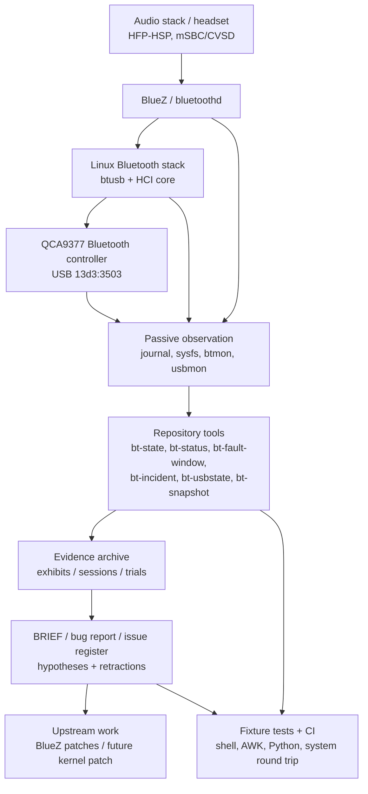
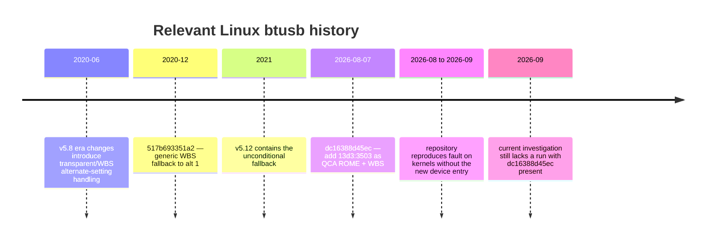

# Deep Review of `ivoitovych/qca9377-bt-hang`

## Executive summary

[`ivoitovych/qca9377-bt-hang`](https://github.com/ivoitovych/qca9377-bt-hang) is not primarily a conventional software project; it is a **forensic hardware/driver investigation packaged as a reproducible evidence repository**, with a substantial diagnostics and experiment-control toolkit built around the investigation. Its target is a Qualcomm Atheros QCA9377 Bluetooth controller exposed as IMC Networks USB device `13d3:3503` on Linux. The observed failure is unusually severe: during transparent synchronous audio, normally mSBC/wideband speech, Linux `btusb` selects USB alternate setting 1, transfers 27-byte SCO buffers through a 9-byte isochronous endpoint as three packets, and the first subsequently observed HCI command receives no reply. Once this happens, the controller has also failed USB control transfers and has generally required removal of power to recover. The repository reports seven reproductions across three 7.0-series Ubuntu kernels, two headset vendors, and both modified and stock USB power-management configurations. fileciteturn11file0L2-L2

The project's strongest technical result is **not yet a root cause**. It has narrowed a vague “Bluetooth hangs” report into a reproducible correlation around the Linux wideband-SCO alternate-setting path. In particular, the repository correctly withdrew an earlier interpretation that `len 27 mtu 9` meant a 27-byte packet was overflowing a 9-byte endpoint; Linux's isochronous descriptor filling splits the buffer into several transactions. It also established that `HCI_Setup_Synchronous_Connection` (`0x0428`) usually succeeds, data flows, and the important boundary is the first HCI command observed after the transparent stream begins. fileciteturn15file0L2-L2

The strongest regression candidate is upstream Linux commit [`517b693351a2`](https://github.com/torvalds/linux/commit/517b693351a2d04f3af1fc0e506ac7e1346094de), “Bluetooth: btusb: Always fallback to alt 1 for WBS.” That change made alternate-setting 1 the generic fallback when alternate setting 6 is unavailable. The patch author's rationale explicitly depended on the empirical assumption that alt 1 works for adapters lacking alt 6; the QCA9377 device here has alternates 1–5 but no 6, making it a plausible counterexample. The change was incorporated for v5.12; the repository identifies v5.8–v5.11 as the clean historical control window because earlier kernels can reach alt 1 by a different mechanism. citeturn4search8turn4search5 fileciteturn12file0L2-L2

There is, however, an important 2026 development that substantially changes what should be tested next. Linux commit [`dc16388d45ec`](https://github.com/torvalds/linux/commit/dc16388d45ecbd3be0d8c9424dbbaa2c81806578), committed on August 7, 2026, added `13d3:3503` to the QCA ROME `btusb` quirks table with `BTUSB_QCA_ROME | BTUSB_WIDEBAND_SPEECH`. Current upstream source therefore no longer has the “missing device ID” condition present in all of the project's tested kernels. That upstream addition was motivated by a different BLE-scanning problem, and the repository has **not tested the Bluetooth-audio fault on a kernel containing this new quirk**. This is now the highest-value missing experiment. citeturn4search12turn3search0 fileciteturn12file0L2-L2

The repository itself is unusually rigorous in evidence retention, explicit retractions, fixtures, instrumentation, privacy sanitization, and test coverage. At the same time, it has accumulated significant complexity very quickly: roughly 4.9 MB by GitHub's repository-size metric, hundreds of commits since August 10, 2026, approximately 776 tracked files in the latest CI checkout, large shell/AWK tooling, extensive review branches, and a very large monolithic shell test runner. The latest inspected GitHub Actions run on `main` was **red**, even though all 810 reported invariants passed: the subsequent coverage gate failed because an exclusion had become stale. More seriously, its log also exposed a false-green dependency problem: several `rg`-based assertions emitted `rg: command not found` yet still passed because the test expressions used `|| true`. This is a concrete maintainability defect and contradicts the project's own principle that analysis failures should fail loudly. fileciteturn20file0L2-L2 fileciteturn21file0L2-L2 fileciteturn24file0L2-L2

My overall assessment is therefore:

| Dimension | Assessment |
|---|---|
| Evidence quality | **Very strong** for an individual hardware investigation |
| Root-cause certainty | **Moderate-to-low**; fault boundary is narrow, mechanism still unknown |
| Reproduction quality | **Moderate**; repeated observations are compelling, but there is no deterministic scripted hardware reproducer |
| Kernel-patch readiness | **Not ready**; no current kernel fix exists |
| Diagnostic-tool engineering | **Strong but overgrown** |
| Test discipline | **Strong intent, substantial implementation, but current CI defects remain** |
| Documentation | **Exceptionally extensive, with some stale/contradictory historical material** |
| Operational safety | **Requires care**; some recovery/workaround actions can worsen the failure |
| Upstream readiness | BlueZ fixes: **already submitted**; controller fix: **needs controlled kernel experiments first** |
| Most important next step | Test the fault on a current kernel containing `dc16388d45ec`, while separating firmware initialization from automatic reset behavior |

## Repository overview and project health

### Purpose and architecture

The repository has three intertwined roles. It is an **evidence archive**, a **measurement/diagnostics suite**, and an **upstream-development staging area**. Its README explicitly separates these into evidence, workaround experiments, and the eventual “real fix.” fileciteturn11file0L2-L2

The architecture can be summarized as follows:



This separation is one of the repository's best design decisions. The author repeatedly distinguishes **what was observed**, **what is inferred**, **what has been retracted**, and **what constitutes an intervention**. For a difficult intermittent hardware problem, this is far more scientifically useful than a conventional issue thread containing evolving unversioned hypotheses. fileciteturn15file0L2-L2

### Main components and key files

The practical entry points are:

| Path | Role | Review |
|---|---|---|
| [`README.md`](https://github.com/ivoitovych/qca9377-bt-hang/blob/main/README.md) | Public front door and current status | Good concise entry point relative to the rest of the tree |
| [`BRIEF.md`](https://github.com/ivoitovych/qca9377-bt-hang/blob/main/BRIEF.md) | Current internal state: established, unresolved, retracted | Probably the best document for understanding epistemic status |
| [`HISTORY.md`](https://github.com/ivoitovych/qca9377-bt-hang/blob/main/HISTORY.md) | Chronological investigation log | Valuable archaeology, but very large |
| [`docs/bug-report.md`](https://github.com/ivoitovych/qca9377-bt-hang/blob/main/docs/bug-report.md) | Proposed kernel-facing report | Technically the cleanest controller-fault description |
| [`docs/missing-quirks-entry.md`](https://github.com/ivoitovych/qca9377-bt-hang/blob/main/docs/missing-quirks-entry.md) | Historical quirk analysis and kernel-version provenance | Especially important after the upstream 2026 quirk addition |
| [`docs/fix-proposal.md`](https://github.com/ivoitovych/qca9377-bt-hang/blob/main/docs/fix-proposal.md) | Earlier quirk-oriented fix design | Useful technically, but its headline proposal is now partly superseded |
| `evidence/exhibits/` | Numbered claims with derivation commands and output | Core research asset |
| `evidence/sessions/` | Captured reproductions | Core research asset |
| `evidence/trials/` | Experiment/trial records and denominators | Good attempt to avoid anecdotal comparisons |
| `tools/` | Postmortem, state, timeline, incident, USB/SCO analysis tools | Broad and increasingly complex |
| `tools/lib/` | Shared journal, time, matching, report logic | Good modularization relative to shell-tool count |
| `bin/` | Long-running collectors/watchdogs | Operationally sensitive |
| `tests/` | Fixture-based behavioral test suite | Extensive; monolithic runner is a concern |
| `devtools/` | Validation, coverage, publishing and commit gates | Sophisticated but contributes heavily to project complexity |
| `patches/bluez/` | Two submitted BlueZ crash fixes | Separate from controller wedge |
| `.github/workflows/checks.yml` | CI policy | Ambitious multi-layer CI |

The implementation is primarily **Shell**, with AWK used for analysis and a small amount of Python for capture-related functionality. GitHub currently identifies Shell as the primary language. The repository is licensed under **GPL-2.0** and GitHub reports a size of 4,898 KiB. fileciteturn14file0L2-L2

### Activity, commits and community signals

The repository was created on **August 10, 2026** and was still being pushed late on **September 19, 2026**, so this is an extremely young and intensely active project. GitHub's commit pagination inspected during this review reached roughly **418 main-branch commits in about six weeks**, indicating very high churn rather than a mature/stable development cadence. The fetched recent history shows frequent evidence corrections, tooling fixes, CI fixes, documentation rewrites and review reactions rather than release-oriented development. Repository metadata currently reports **0 stars, 0 forks and 0 open issues**. fileciteturn14file0L2-L2

Mainline authorship also appears highly concentrated around Iaroslav Voitovych. The repository has many `review/*`, `backup/*`, `tests/*`, `claude/*` and evidence snapshot branches—23 branches were returned in the inspected branch listing—but all were unprotected, including `main`. This is understandable for a personal research notebook, but it is not the governance structure one would want if the project becomes a maintained Linux troubleshooting package. fileciteturn25file0L2-L2

Several commits are particularly important to understanding how the investigation evolved:

| Repository commit | Significance |
|---|---|
| [`848b164`](https://github.com/ivoitovych/qca9377-bt-hang/commit/848b164442af5a31fb8247baa876029d2099bf1d) | `EX-023`: controller left alone for ~3 h 22 m, followed by deliberate USB reset and rapid USB disappearance; major evidence that late reset can be harmful |
| [`8b6f663`](https://github.com/ivoitovych/qca9377-bt-hang/commit/8b6f663c8c926998683d23d92b7d87c7f771603f) | `EX-029`: >13-hour untreated HCI wedge without spontaneous USB collapse |
| [`b8ad092`](https://github.com/ivoitovych/qca9377-bt-hang/commit/b8ad092a52127f064fcc4deac20da36b10b533a3) | `EX-037`: strengthened alt-1 traffic hypothesis and corrected earlier extraction assumptions |
| [`65cf8b3`](https://github.com/ivoitovych/qca9377-bt-hang/commit/65cf8b3c885e81692332376133c2a43cce71886b) | Direct `sysfs` observation that live failing SCO interface is actually on alternate setting 1 with 9-byte isochronous endpoints |
| [`bcf12fc`](https://github.com/ivoitovych/qca9377-bt-hang/commit/bcf12fc567b5a0107f76b73a3a2f8913a62b584a) | `EX-043`: stock power policy also fails; destroys the misleading “~2.15-second constant” interpretation |
| [`6ca042e`](https://github.com/ivoitovych/qca9377-bt-hang/commit/6ca042e0c55400c8715b1a149d0d4e289a9f8f7e) | Makes several diagnostic tools probe-free by default after realizing they could themselves issue HCI commands during valuable untreated windows |
| [`984706e`](https://github.com/ivoitovych/qca9377-bt-hang/commit/984706efc43f4e0066a27ca14e822ae61f6faff2) | Corrects two major narrative points: upstream now has the device quirk; 27/9 is packet splitting, not overflow |

That history is simultaneously reassuring and cautionary. The maintainer is unusually willing to **retract wrong conclusions publicly**, which increases trust in the current state. But the volume of corrections demonstrates that readers should rely on current `BRIEF.md`/`README.md`/`docs/bug-report.md`, not old exhibits or historical prose without checking their correction banners. fileciteturn15file0L2-L2

## Technical analysis of the controller fault

### What is actually established

The most defensible current failure sequence is:

```mermaid
sequenceDiagram
    participant H as Headset
    participant B as BlueZ / host
    participant K as btusb / HCI core
    participant Q as QCA9377

    H->>B: HFP/HSP wideband session
    B->>K: Setup synchronous connection (0x0428)
    K->>Q: HCI 0x0428
    Q-->>K: Successful response / handle allocated
    K->>K: Transparent-SCO notification
    K->>K: Look for USB alt 6
    K->>K: Fall back; interface becomes alt 1
    Note over K,Q: 9-byte isoch endpoints
    K->>Q: 27-byte SCO buffers as 3 x 9-byte packets
    Note over B,Q: Stream can continue for milliseconds or seconds
    B->>K: First subsequently observed HCI command
    K->>Q: e.g. HCI Disconnect 0x0406
    Q--xK: No response
    K->>K: ~2 s HCI_CMD_TIMEOUT
    B->>Q: Later commands / reset requests
    Q--xB: No useful response
    Note over Q: Device remains USB-enumerated in long untreated windows
    B->>Q: Power removed
    Q-->>B: Controller recovers after cold power cycle
```

Seven observed failures form the principal dataset: fileciteturn15file0L2-L2

| Exhibit | Kernel | Power policy | `len 27 mtu 9` buffers | Time to first observed command | Setup → timeout |
|---|---|---|---:|---:|---:|
| EX-033 | 7.0.0-29 | Modified | 835 | 36 ms | 2.076 s |
| EX-036 | 7.0.0-30 | Modified | 87 | 279 ms | 2.152 s |
| EX-037 | 7.0.0-30 | Modified | 680 | 39 ms | 2.151 s |
| EX-038 | 7.0.0-31 | Modified | 682 | 35 ms | 2.191 s |
| EX-040 | 7.0.0-31 | Modified | 1,562 | 34 ms | 2.140 s |
| EX-042 | 7.0.0-31 | Modified | 1,595 | ~90 ms | 2.147 s |
| EX-043 | 7.0.0-31 | **Stock** | 910 | **9.650 s** | **11.874 s** |

`EX-043` is especially important. The stream ran for about 9.65 seconds before the first observed HCI command. The timeout then followed approximately one command-timeout interval later. Thus the earlier cluster around ~2.15 seconds was not a device-internal “death timer”; it mostly reflected userspace tearing the synchronous connection down almost immediately after setup. fileciteturn17file0L2-L2

The project has also observed a CVSD/narrowband synchronous path operating successfully with a larger endpoint MTU. Consequently, the evidence does **not** support the broad statement “QCA9377 SCO is broken.” The narrower transparent/WBS/alt-1 path is the meaningful discriminator. fileciteturn17file0L2-L2

### What is not established

Four causal questions remain open.

First, the evidence does **not prove that the first HCI command causes the hang**. It proves that this is the first operation observed failing. The controller may already have entered an internal dead state because of the preceding isochronous traffic, with the first command merely acting as the liveness probe that reveals it. The repository explicitly preserves this distinction. fileciteturn15file0L2-L2

Second, there is no controlled same-kernel A/B experiment in which alt 1 is deliberately allowed versus deliberately prohibited while every other variable is held constant. The current association—seven failures with the characteristic path and one short survival—is compelling, but remains observational. fileciteturn15file0L2-L2

Third, there is no evidence identifying the precise controller-side mechanism. Plausible classes include a QCA firmware state-machine bug, an interaction between transparent SCO framing and this USB endpoint configuration, or another device-side queue/state problem. None has yet been discriminated experimentally. fileciteturn17file0L2-L2

Fourth, the effect of **proper QCA firmware initialization in current upstream Linux is unknown**. This is now critical because the newest upstream quirk causes `btusb_setup_qca()` to run for this USB ID; all of the project's reproductions were on kernels lacking that mapping. fileciteturn12file0L2-L2 citeturn4search12turn3search0

### The two relevant upstream kernel changes

The historical relationship is:



The first change, [`517b693351a2`](https://github.com/torvalds/linux/commit/517b693351a2d04f3af1fc0e506ac7e1346094de), converted lack of alternate setting 6 into a fallback to alt 1 for WBS. The original patch discussion says many adapters did not have alt 6 and records the author's observation that alt 1 seemed to work for adapters supporting WBS. That makes a device-specific incompatibility with alt 1 a credible regression hypothesis—not proof, but a technically well-motivated one. citeturn4search8turn4search5

The second change, [`dc16388d45ec`](https://github.com/torvalds/linux/commit/dc16388d45ecbd3be0d8c9424dbbaa2c81806578), adds:

```c
{ USB_DEVICE(0x13d3, 0x3503), .driver_info = BTUSB_QCA_ROME |
                                             BTUSB_WIDEBAND_SPEECH },
```

to the current upstream driver's quirk table. That activates the QCA-specific setup/reset/shutdown machinery that the investigation's tested kernels lacked. Current `btusb.c` contains the entry. citeturn4search12turn3search0

This dramatically changes the interpretation of the repository's earlier “missing quirk” work. The missing entry was a **real defect in the kernels tested**, and plausibly explains why those kernels had neither QCA initialization nor a reset callback. It should no longer be presented as the proposed upstream fix, however, because upstream has already independently made the change—and for another observed problem. The repository now says this explicitly. fileciteturn12file0L2-L2

### Why recovery results require caution

The evidence around resetting the controller is one of the project's more important findings.

Long untreated wedges have remained USB-enumerated for hours. `EX-029`, for example, observed more than 13 hours without spontaneous USB-layer collapse. By contrast, several attempted resets/rebinds/reloads of an already-wedged controller were followed by USB enumeration failure. Thus “USB disappearance” cannot currently be assumed to be the natural second stage of the original fault. fileciteturn17file0L2-L2

This matters because `BTUSB_QCA_ROME` installs `hdev->reset = btusb_qca_reset`, and the HCI core can invoke the driver's reset callback when a command times out. The project's userspace reset experiments were mostly **late**—roughly 11–33 seconds after the first timeout or much later—whereas the kernel callback would happen at the first timeout. Those are not equivalent experiments. One reset performed before any timeout did recover service, although the controller failed again later. fileciteturn16file0L2-L2

Accordingly:

**“Resetting the wedged controller is dangerous” is well supported for the tested late-reset scenarios. “The new upstream QCA reset callback will make things worse” is not established.**

## Kernel compatibility, firmware and deployment implications

### Kernel-version comparison

The most useful compatibility table is not simply “old versus new.” There are two independently changing behaviors: the WBS alt-1 fallback and the QCA9377 device quirk.

| Kernel/tree class | WBS behavior relevant to this device | `13d3:3503` QCA quirk | Evidence status | Practical interpretation |
|---|---|---|---|---|
| ≤ v5.7 | Alt 1 can be reached by an older SCO-selection mechanism | No current 2026 entry | Not tested by project | **Not a clean control** |
| v5.8–v5.11 | Generic device lacking alt 6 does not take the later unconditional alt-1 WBS fallback | No current 2026 entry | **Not tested** | Best historical control window for `517b693351a2` |
| v5.12 through older modern kernels | Unconditional “alt 6 else alt 1” fallback present | Depends on tree/backports | Project's reproduced versions are in this behavior family | Primary suspected regression side |
| Ubuntu kernels 6.17.0-29/35/40, 7.0.0-28 | Post-v5.12 behavior | Project reports no new quirk entry | Earlier hang phenotype observed | Supports “not a recent regression” |
| Ubuntu 7.0.0-29/-30/-31 | Post-v5.12 behavior | No new quirk entry in project environment | **Seven detailed signature reproductions** | Strongest existing data |
| Current upstream after `dc16388d45ec` | Post-v5.12 alt-1 behavior remains | **QCA ROME + WBS now present** | **Untested by project** | Highest-priority environment to test |

The version-history analysis for the alternate settings comes from source comparison recorded by the project and the upstream WBS fallback patch; the current quirk is independently visible in upstream Linux. fileciteturn12file0L2-L2 citeturn4search8turn3search0

A crucial deployment consequence follows: **kernel version alone is no longer enough to predict behavior.** Distribution kernels frequently backport device-ID fixes. The reliable procedure is to inspect the actual `btusb` source/module or runtime setup logs for the `13d3:3503` QCA entry rather than assuming a particular distro release does or does not contain `dc16388d45ec`. The repository's `bt-verify-kernel-mechanism` exists partly for this reason. fileciteturn12file0L2-L2

### Firmware implications

`BTUSB_QCA_ROME` does much more than provide a reset callback. The repository's source analysis records that it configures QCA-specific USB setup, shutdown, BD-address handling, simultaneous-discovery behavior and reset/resume behavior. Most importantly for root-cause work, `btusb_setup_qca()` can load QCA rampatch/NVM firmware. fileciteturn16file0L2-L2

That creates two materially different hypotheses:

1. **USB alternate-setting regression hypothesis:** Linux drives otherwise functional controller firmware into a bad state specifically because `517b693351a2` allows WBS over alt 1 on this device.

2. **Initialization/firmware hypothesis:** the tested kernels treated `13d3:3503` as generic Bluetooth hardware and therefore never performed the QCA ROME initialization current upstream considers appropriate; the WBS path merely exposes a firmware problem that a proper rampatch/NVM initialization might already solve.

The current evidence cannot distinguish these. Testing a modern tree containing `dc16388d45ec` is therefore logically prior to proposing a permanent new alt-setting quirk.

### Distro and deployment guidance

For an affected production system today, I would rank options as follows:

**Safest:** avoid the triggering wideband hands-free mode. A2DP playback does not exercise SCO in the same way, and the repository has positive evidence that CVSD/narrowband synchronous audio can operate without the signature. That is a loss of voice quality or functionality, but it does not deliberately reset a controller known to react badly to some recovery attempts. fileciteturn17file0L2-L2

**Next safest:** run only the repository's passive diagnostics, especially `bt-diagnose`, `bt-state`, `bt-status`, `bt-usbstate` and capture tooling in their non-probing modes. The project intentionally changed these tools to avoid sending HCI commands merely to ask “is it alive?” fileciteturn15file0L2-L2

**Experimental:** test a kernel containing the new upstream QCA quirk after a cold boot, preferably on noncritical hardware and with complete logging from startup. The new tree changes both firmware initialization and reset behavior and therefore must be treated as an experiment rather than an assumed fix. citeturn4search12

**Not recommended on a valuable machine:** installing the repository's active watchdog and letting it automatically reset/rebind a wedged controller. The README itself warns that the watchdog's recovery operation has produced destructive outcomes in controlled experiments and recommends `--tools-only` on a measurement machine. fileciteturn11file0L2-L2

## Code quality, testing, documentation and security assessment

### Engineering quality

The repository has several uncommon strengths.

Its best feature is **epistemic discipline**. `BRIEF.md` contains an explicit “settled,” “not settled” and “retracted” model. Major mistakes—including the meaning of the 27/9 transfer sizes, an earlier incorrect trigger interpretation, autosuspend correlation, a copied boot ID and misinterpretation of event identifiers—remain documented rather than silently disappearing. fileciteturn15file0L2-L2

The tooling architecture also improved materially over time. Journal-reading tools share a fixtureable abstraction rather than hard-coding `journalctl`; coredump access has a similar seam; evidence captures are sanitized; analysis tools can be run against fixtures; and tests explicitly prevent themselves from writing fabricated data into the real evidence tree. fileciteturn19file0L2-L2

The test philosophy is unusually strong for shell tooling: the project requires tests to correspond to actual previously shipped defects and tries to demonstrate that new tests fail when the protected behavior is broken. It also separates a dangerous install/uninstall system round-trip from ordinary hermetic tests and runs that real system test only under explicit gates. fileciteturn19file0L2-L2

CI is similarly ambitious. The workflow includes syntax/validation checks, the behavioral suite, shell coverage, AWK statement coverage, Python coverage, per-tool comprehensiveness, journal-contract testing, installation round-trip testing and a publish/privacy scan. fileciteturn20file0L2-L2

### Maintainability concerns

The main problem is **scope explosion**. A hardware investigation that began in August has developed hundreds of commits, hundreds of tracked files, several generations of tooling, a custom experiment framework, several coverage implementations, extensive review infrastructure and very large historical documents. This makes the project much better at preserving evidence, but also makes it increasingly easy for the instrumentation to become the object being debugged.

A related problem is centralization in `tests/run-tests`. Although the suite is conceptually divided into sections, it remains a very large shell test program. This creates exactly the kind of global dependency and hidden failure-mode problem seen in the latest CI run.

That CI run exposes two concrete issues.

First, current `main` was **not green** at the latest inspected head. `repo-validate` succeeded and all **810 invariants** reported success, but the separate coverage stage failed because `devtools/coverage-exclude` listed code that had started executing. Every later stage was therefore skipped. fileciteturn21file0L2-L2

Second—and more concerning—the same log printed `rg: command not found` while several `rg`-dependent checks still received a green tick. The implementation explains why:

```bash
retired=$(rg ... || true)
if [[ -z "$retired" ]]; then
    ok ...
fi
```

and analogous code exists for other documentation assertions. With `rg` absent, command failure becomes empty output, which is indistinguishable from “no forbidden text found.” fileciteturn24file0L2-L2

That should be considered a **high-priority correctness bug in the test harness**. It is particularly notable because the project's own documented rule is that analysis failures must fail loudly rather than be converted into zero-result evidence. fileciteturn19file0L2-L2

The current CI environment also does not exercise every integration contract: the inspected log noted absent Bluetooth command-line utilities for some guarded paths and no retained coredump with which to validate the coredump fixture against a live tool. Thus “810 invariants pass” should not be read as complete platform validation.

### Documentation quality

Documentation is both an exceptional strength and a weakness.

The evidence provenance is much better than typical bug repositories, and the current-facing documents explicitly avoid claims that the data no longer support. Yet historical layers are so extensive that stale material remains easy to encounter. The most obvious example is [`docs/fix-proposal.md`](https://github.com/ivoitovych/qca9377-bt-hang/blob/main/docs/fix-proposal.md), whose title still frames adding `13d3:3503` to the QCA ROME table as the proposed fix even though current upstream has already done so and the project's front page explicitly says that one-line quirk is no longer considered the controller-wedge fix. fileciteturn16file0L2-L2 fileciteturn12file0L2-L2

I would therefore treat documentation as having **high factual quality at the current-state layer, but substantial navigation/staleness risk across the full tree**.

### BlueZ patch quality

The two BlueZ patches are a separate, positive outcome of the investigation.

`0001` fixes a path where `start_discovery_complete()` can use a management reply before validating its length. `0002` prevents `transport_cb()` from handing a null `setup->stream` into code that dereferences it. The second guard was observed firing four times on the affected system, making it much stronger than a speculative NULL check; the first has supporting trace reconstruction but its new guard had not fired in ordinary use at the time of submission. Both were reported as applying cleanly to contemporary BlueZ, compiling, passing BlueZ's configured checkpatch rules, and applying independently in either order. They were sent as two independent messages to `linux-bluetooth` on September 19, 2026. fileciteturn18file0L2-L2

They should **not** be described as fixes for the QCA9377 hardware wedge. The repository has reproduced the controller failure with the patched daemon running. fileciteturn15file0L2-L2

### Security and stability risks

The principal impact demonstrated by the QCA issue is **availability**, not a proven confidentiality or code-execution vulnerability. The Bluetooth controller can become nonresponsive and require a complete power cycle. No kernel memory-corruption mechanism has been established.

The repository itself nevertheless has several operational risks:

| Risk | Severity | Reason |
|---|---|---|
| Automatic USB reset/rebind of a wedged device | **High** | Controlled experiments have converted long-lived enumerated wedges into USB disappearance requiring power removal |
| Running `install.sh --apply` on the research machine | **High for evidence / medium for host stability** | Installs active instrumentation/watchdog and may change the state being measured |
| Root-running shell tooling | **Medium** | Broad shell/systemd/udev surface means ordinary scripting mistakes can have system-level effects |
| Probing a live untreated failure | **Medium-high for research validity** | An HCI command may itself be causally relevant; a “status check” can destroy the clean observation |
| Raw Bluetooth/kernel captures | **Medium privacy risk** | Device addresses, network identifiers and similar metadata may be retained |
| Current CI false-green dependency behavior | **Medium** | A missing analyzer can make some negative assertions pass |
| Unprotected main / branch proliferation | **Low-medium for a personal repo** | Raises accidental-history and governance risk if collaboration increases |

The project deserves credit for explicitly addressing several of these: log sanitization, publish scanning, 0600-style capture handling, probe-free defaults, fixture isolation and warnings around active installation. fileciteturn11file0L2-L2 fileciteturn20file0L2-L2

## Recommended fix strategy and prioritized actions

The repository has reached the point where **more observational logging on the same old kernel configuration has sharply diminishing value**. The next work should be controlled kernel experiments designed to separate competing hypotheses.

### Priority matrix

| Priority | Proposed action | Question answered | Expected value | Risk |
|---|---|---|---|---|
| **P0** | Fix current CI: install/check `ripgrep`, remove false-green `|| true` patterns, repair stale coverage exclusion | Can we trust the project gates? | Very high | Low |
| **P0** | Test a current kernel containing `dc16388d45ec` after full cold power cycle | Does proper QCA ROME setup already eliminate the wedge? | Extremely high | Medium |
| **P0** | In that experiment, capture QCA setup/firmware version/status before triggering WBS | What firmware/setup path is actually active? | Extremely high | Low-medium |
| **P1** | Build a variant with QCA setup enabled but automatic timeout reset disabled | Does firmware initialization prevent the failure independently of recovery? | Extremely high | Medium |
| **P1** | Controlled same-tree variant that prevents alt-1 WBS specifically for `13d3:3503` | Is alt 1 causally necessary? | Extremely high | Low-medium |
| **P1** | Test v5.8–v5.11 once as historical control | Does pre-`517b693` behavior avoid the failure? | High | Low, though old kernel hardware compatibility may complicate test |
| **P1** | Force sustained transparent SCO, then issue different HCI opcodes at controlled times | Does any HCI command fail, or specifically teardown/disconnect? | High | Medium |
| **P2** | Determine why WBS sometimes persists and sometimes collapses to CVSD | Explains survival versus failure paths | High | Low |
| **P2** | Reduce/partition monolithic test suite and dependency-check every external command | Long-term maintainability | High | Low |
| **P3** | Clean stale docs/branches and introduce releases/tags | Usability/governance | Medium | Low |

### Recommended experimental kernel ladder

A simple “stock versus patched” test is no longer adequate because `BTUSB_QCA_ROME` changes multiple things at once. The experiment should isolate the variables.

A useful ladder is:

| Build | QCA firmware/setup | Automatic QCA reset | Alt-1 WBS fallback | Purpose |
|---|---:|---:|---:|---|
| A | No | No | Yes | Reproduce known baseline on one fixed current kernel tree |
| B | **Yes** | No | Yes | Test firmware/init prevention hypothesis |
| C | No or baseline-equivalent | **Yes** | Yes | Test recovery callback separately, preferably only after B establishes safety |
| D | **Yes** | **Yes** | Yes | Approximate current upstream behavior |
| E | **Yes** | No initially | **Blocked for this device** | Test whether alt 1 is causally necessary |
| F | Same as E but alternate experimentally selected path | No | Different alt behavior | Only after descriptor/MTU requirements are understood |

Build B is the most important. The current upstream device quirk combines initialization and recovery, but the repository's existing evidence warns that automatically resetting an already-wedged controller could censor or worsen the incident. Separating setup from reset allows the most valuable question—“did correct QCA firmware initialization prevent the wedge?”—to be answered without immediately invoking the most hazardous intervention. The reason for this separation is supported directly by the multi-behavior analysis in `docs/fix-proposal.md`. fileciteturn16file0L2-L2

### What a likely upstream controller fix should look like

It is too early to recommend a final code diff, but the decision tree is now reasonably clear.

If **Build B eliminates the failure**, the likely answer is not another WBS-alt-setting quirk at all; the 2026 QCA ROME device-table addition may already contain the effective prevention by ensuring correct firmware initialization. The next work would then be reproducing that result sufficiently and considering stable backports of `dc16388d45ec`. citeturn4search12

If the fault **persists with correct QCA firmware but disappears when alt 1 is prohibited**, then `13d3:3503` becomes strong evidence against the generic assumption introduced by `517b693351a2`. The right upstream fix would probably be a **device-specific or capability-driven WBS-alt-setting restriction**, not reverting the generic fallback for every Bluetooth USB adapter. citeturn4search8turn4search5

If the fault persists even when alt 1 is blocked, then the current central hypothesis is wrong or incomplete, and work should move toward transparent-SCO/HCI interaction more generally.

If only `Disconnect` causes the failure, then the bug boundary becomes a controller/driver state transition between active transparent SCO and HCI teardown rather than the broad “first HCI command” hypothesis.

### Workaround hierarchy

For end users who are not kernel developers, the practical order should be:

1. **Prefer avoiding mSBC/WBS hands-free mode** on this specific controller when reliability matters.
2. Use **passive diagnostics**, not aggressive recovery scripts.
3. On a test machine, try a kernel carrying the new QCA9377 quirks entry and appropriate QCA firmware.
4. Cold power-cycle after a wedge rather than repeatedly resetting/rebinding the already nonresponsive device.
5. Consider hardware replacement where operational reliability matters more than preserving this controller; this is an engineering workaround, not evidence about fault attribution.

The repository's own active watchdog should be regarded as an **experiment harness, not a production-grade cure**. fileciteturn11file0L2-L2

## Reproduction and validation plan

### Baseline reproduction

A disciplined reproducer should begin from a **cold-powered controller**, because a warm reboot may not be sufficient to return the chip to a known firmware/device state. Record before the test:

```text
Kernel commit and config
btusb module/version/hash
Presence/absence of the 13d3:3503 QCA quirk
linux-firmware package/version
Exact QCA rampatch/NVM files selected, if any
USB descriptors for all alternate settings
HCI manufacturer/version/revision data
BlueZ version
Headset model and negotiated voice codec
USB host controller
USB power/autosuspend configuration
```

The repository's observed target sequence is then:

```text
1. Establish HFP/HSP with mSBC / transparent synchronous audio.
2. Verify 0x0428 Setup Synchronous Connection receives its response.
3. Observe transparent-SCO notification.
4. Verify the SCO USB interface actually reaches bAlternateSetting = 1.
5. Verify endpoint wMaxPacketSize = 9.
6. Let audio run for a controlled interval.
7. Issue exactly one preselected HCI command.
8. Record whether that command receives a response.
9. If it fails, perform NO automatic reset in the observational arm.
10. Record HCI and USB-control liveness separately.
```

This follows the strongest existing evidence while avoiding the project's earlier mistake of treating a liveness probe as passive observation. fileciteturn17file0L2-L2

### Command-causality matrix

The next reproductions should deliberately randomize or rotate the first command after stream establishment:

| First command after stream | Purpose |
|---|---|
| `Disconnect` (`0x0406`) | Existing positive-control command |
| A harmless informational HCI read | Tests “any command” hypothesis |
| No command for 30–60 seconds | Tests whether stream alone eventually destroys command responsiveness |
| Disconnect after 1 s | Timing point |
| Disconnect after 10 s | Reproduce EX-043-like delayed case |
| Disconnect after 30 s | Extends untreated stream interval |

A successful “no-command” arm must not use `hciconfig`, `btmgmt`, D-Bus actions or another tool that generates commands under the hood. Passive `sysfs`, kernel logging and host-side USB capture are preferable.

### Alt-setting causality experiment

The single strongest causal experiment would use the **same kernel source tree** and change only the WBS alt-selection policy for this device.

Success criterion for the hypothesis:

```text
alt-1 enabled:
    repeated transparent-SCO trials reproduce the non-response

alt-1 blocked:
    equally long and equally numerous transparent-SCO attempts
    do not produce controller non-response
```

A “no failure” result must have positive controls showing that the intended stimulus was actually reached; the repository itself has already learned that counting SCO setup requests without proving the target path was active can produce a misleading clean result. fileciteturn19file0L2-L2

### Firmware/init experiment

For a kernel containing `dc16388d45ec`, record QCA initialization logs from HCI open. Then compare cold-boot trials between:

```text
QCA setup disabled / historical generic binding
versus
QCA setup enabled / current upstream binding
```

Keep automatic reset disabled in the first prevention experiment if practical, because otherwise a failure produces both an onset and an immediate treatment in the same trial.

The validation endpoint should not merely be “Bluetooth still appears in the GUI.” It should include:

- HCI command completion.
- USB standard-control request completion.
- Continued SCO/A2DP operation.
- Absence of unexpected reset/rebind.
- Correct post-call ability to scan, connect and disconnect.
- Repeated trials across both headsets already known to reproduce the bug.
- A cold-power-cycle boundary between treatment changes.

### Repository CI validation

Before more kernel conclusions are committed, the project should also restore a trustworthy software-validation baseline:

```bash
command -v rg >/dev/null || {
    echo "ripgrep is required by the test suite" >&2
    exit 1
}
```

Every “search found nothing” assertion should distinguish:

```text
search succeeded, zero matches    => valid negative result
search failed                     => test failure
```

rather than converting both into an empty string with `|| true`. The currently inspected `tests/run-tests` code does not preserve that distinction for several `rg` checks. fileciteturn24file0L2-L2

The CI workflow should also install every tool required by mandatory assertions and preferably end with a small summary that explicitly distinguishes **passed**, **skipped because dependency absent**, and **not run because an earlier gate failed**. The current workflow already has good independent coverage layers; the missing piece is making environmental incompleteness impossible to mistake for validation. fileciteturn20file0L2-L2

## Overall conclusions and open questions

This repository is unusually good at one thing that kernel debugging badly needs: **turning an intermittent personal hardware problem into an auditable chain of evidence**. The progression from “Bluetooth randomly dies” to “a QCA9377 on transparent SCO reaches USB alternate setting 1, carries 27-byte buffers through 9-byte isochronous transactions, and the first subsequently observed HCI command does not receive a reply” is a genuine technical accomplishment. The direct `sysfs` confirmation of alt 1, multi-headset reproduction, long untreated windows, stock-power reproduction and preservation of falsified hypotheses all materially raise the quality of the case. fileciteturn11file0L2-L2

The project has **not yet demonstrated the mechanism** or produced the kernel patch the investigation ultimately seeks. `517b693351a2` is a good regression candidate, but the evidence does not yet establish it as the cause. More importantly, the environment has changed upstream: `dc16388d45ec` now causes this exact USB ID to take the QCA ROME setup path that none of the detailed reproductions used. Until that tree is tested, a patch designed solely around alternate-setting behavior would be premature. citeturn4search12turn3search0

The key unresolved research questions are therefore:

**Does the failure reproduce on current upstream Linux with `dc16388d45ec` present?** This is now the first question.

**What exact QCA firmware/rampatch/NVM state differs between the old generic-binding kernels and current QCA-aware `btusb` initialization?**

**Does blocking alt 1, on the same otherwise-identical kernel, eliminate the fault?** That is the missing causal intervention.

**Is the controller already dead before the first HCI command, or does that command trigger the bad state?** A command-free transparent-SCO observation and controlled alternative opcodes should settle much of this.

**Is `Disconnect` special?** Both explicitly identified dying commands were disconnects; “any HCI command” remains a hypothesis.

**Why do some transparent links persist on WBS while others rapidly fall back to CVSD, and is that difference the actual determinant of survival?**

**What is the exact controller-side failure mode?** Firmware deadlock, transport state, buffer/queue state and other device-internal explanations remain undistinguished.

**How does the newly installed QCA reset callback behave at the precise first-timeout boundary?** Existing late USB-reset experiments do not answer this and should not be extrapolated to it.

**Will the two submitted BlueZ patches be accepted or superseded upstream?** Their engineering case is reasonably strong, especially patch `0002`, but their eventual upstream disposition was not established in the repository material available for this review. fileciteturn18file0L2-L2

**Can the investigation tooling be reduced without losing evidentiary strength?** The current 800-plus-invariant, hundreds-of-file research environment is sophisticated but increasingly carries its own failure modes, as the current red CI and `rg` false-green behavior demonstrate. fileciteturn21file0L2-L2

The most defensible final assessment is therefore **“high-quality investigation, strong fault localization, incomplete causal proof.”** The repository already contains enough evidence to justify serious upstream attention, but the decisive next contribution is not another layer of observational tooling. It is a small series of controlled kernel experiments—current QCA initialization versus historical generic initialization, and alt-1 permitted versus prohibited—performed on one fixed kernel baseline. Those experiments can turn the current strong correlation into either a falsified theory or a patchable Linux driver defect.