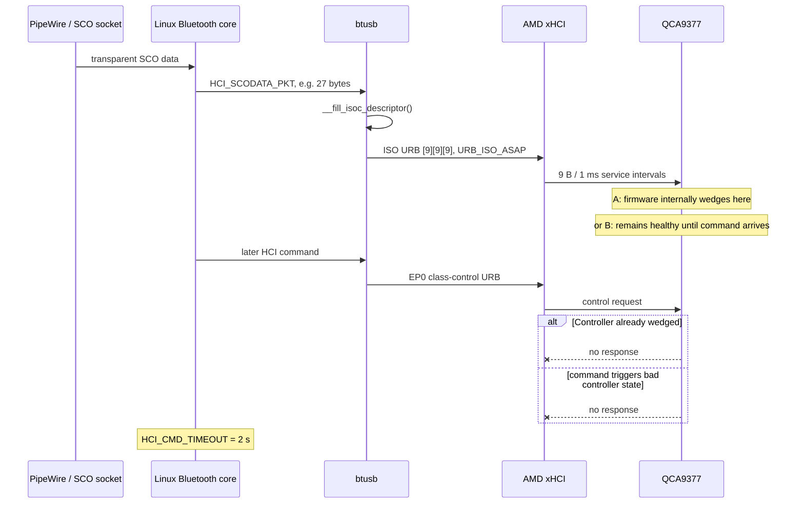
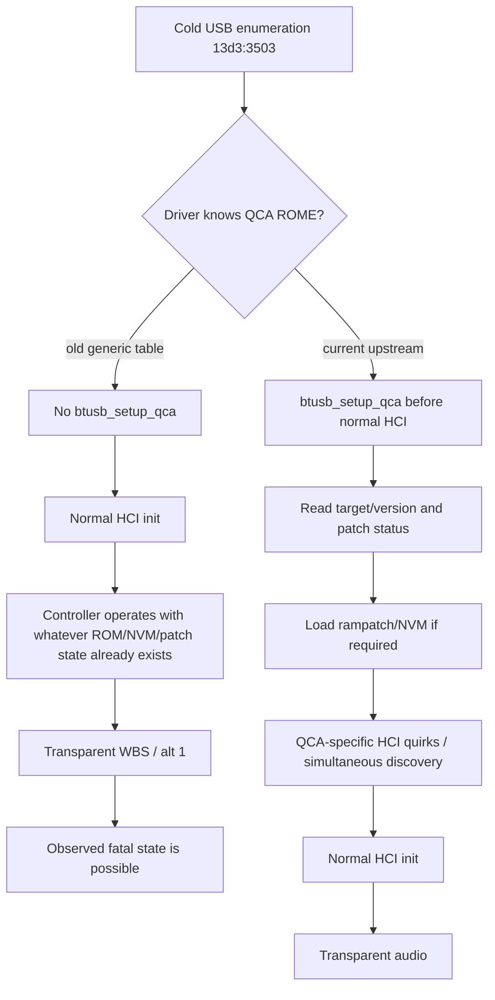
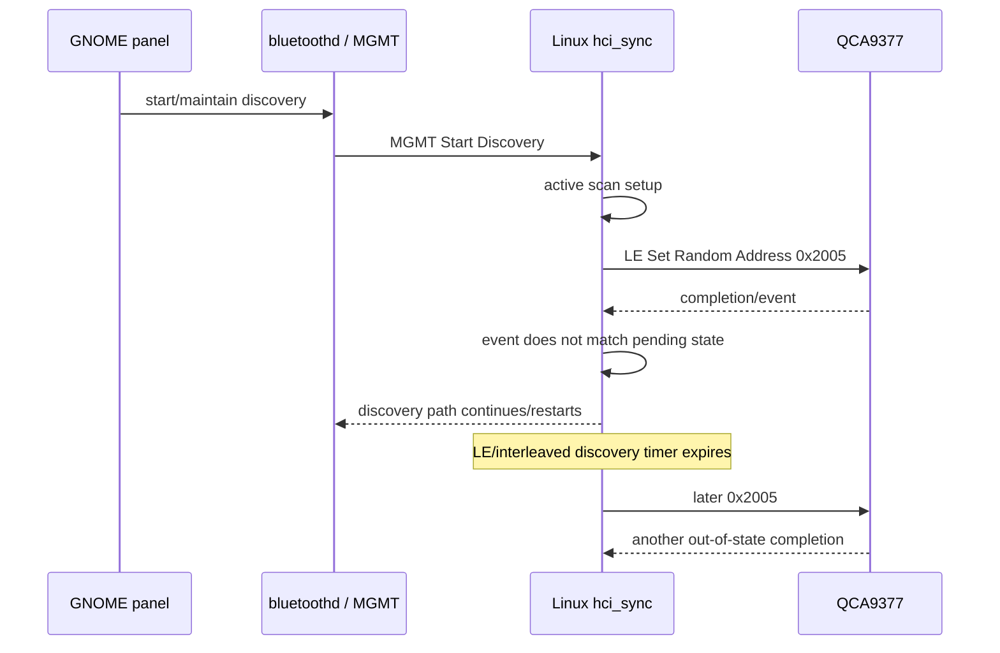

# QCA9377 Bluetooth Hang: Source-Level Review and Upstream Fix Assessment

*(The outside reviewer's report of 2026-09-26, as received, except that inline citation
markers, which carried no content, were removed when it was ported to `main` on 2026-10-09.)*

## Executive summary

I reviewed the private task document, its current `BRIEF.md`, the repository’s exhibit index and the most relevant exhibits, then traced the corresponding paths in current Linux Bluetooth/USB/xHCI source and BlueZ. I also reviewed the upstream history around the exact QCA9377 USB ID `13d3:3503`, especially Linux commits `517b693351a2`, `baac6276c0a9`, `55981d354181`, and `dc16388d45ec`. The task’s central requirement is correctly framed: the evidence already establishes the symptoms; the remaining job is to identify which source mechanisms are actually capable of producing them and which hypotheses should be discarded.

My main conclusion is that **the strongest source-level lead for BT-1 is not a generic Linux alt-1 framing bug, and it is not xHCI bandwidth starvation. It is the fact that this exact QCA9377 USB ID was being driven as a generic Bluetooth USB controller, without the QCA ROME initialization path that current upstream Linux now explicitly assigns to it.** Commit `dc16388d45ecbd3be0d8c9424dbbaa2c81806578` adds exactly `13d3:3503` as `BTUSB_QCA_ROME | BTUSB_WIDEBAND_SPEECH`; its commit message specifically says the device requires Qualcomm ROME firmware handling and wideband-speech support to function properly, and mentions the same `0x2005` BLE failure seen in this repository.

That does **not** yet prove that missing QCA setup causes the fatal SCO/alt-1 wedge. The evidence does prove, however, that several earlier causal stories are too strong. An Enhanced Setup Synchronous Connection was answered and followed by roughly 17 minutes of survival even though the transport still selected alt 1, so neither “that setup command wedges it” nor “entering alt 1 immediately and necessarily wedges it” survives the newer evidence. The private brief explicitly retracts earlier interpretations along those lines.

The most important source finding around the observed `len 27 mtu 9` pattern is:

> **A 27-byte HCI SCO packet represented by one isochronous URB containing three 9-byte ISO frame descriptors is structurally consistent with the Bluetooth USB transport specification.**

Linux's generic `__fill_isoc_descriptor()` divides the URB into `mtu`-sized service-interval descriptors; for alt 1 that gives `9 + 9 + 9`. The Bluetooth USB transport specification explicitly describes a 27-byte HCI packet being carried by 9 bytes in each of three 1-ms full-speed frames for alt 1. The special mSBC alt-6 helper is special because a complete mSBC packet can fit into one 63-byte USB transaction and therefore needs deliberate empty service intervals to obtain the approximately 7.5-ms packet cadence; that does **not** imply that the ordinary alt-1 three-descriptor representation is malformed.

That rules out an important version of candidate **(c)**: “the three × 9-byte split itself is invalid USB/HCI framing.” It is not. There could still be a **device-specific timing or firmware tolerance problem** when mSBC is driven continuously at the limit of alt 1, but that is a different claim and needs on-wire evidence before changing a mature generic path.

Candidate **(a), simply adding `BTUSB_USE_ALT3_FOR_WBS`, is even weaker than it first appears.** Current `btusb_work()` only chooses alt 3 when that flag is set **and `hdev->sco_mtu >= 72`**. The repository has observed `SCO MTU 50:8`. Therefore adding the flag alone would still select alt 1. Commit `55981d3541812234e687062926ff199c83f79a39` deliberately introduced that MTU check because forcing alt 3 on low-MTU devices had already produced broken or garbled audio. A “force QCA9377 to alt 3 despite MTU 50” patch would therefore be a new experimental override of an intentional compatibility guard, not a straightforward upstream fix.

The highest-information **single cold-boot experiment** is consequently candidate **(d): QCA ROME setup without the automatic QCA reset callback and, for diagnostic purity, without changing the existing WBS advertisement policy more than necessary**. In practice I would build an `updates/` `btusb` module that recognizes `13d3:3503` as QCA ROME and executes `btusb_setup_qca()` at open, but suppresses `hdev->reset = btusb_qca_reset` for this diagnostic build. Then cold boot and reproduce the same transparent-mSBC/alt-1 case. If the device still selects alt 1, still emits the same 27→9+9+9 USB traffic, yet survives HCI commands during/after sustained audio, the generic framing hypothesis becomes very weak and the missing QCA firmware/NVM/setup path becomes the leading causal explanation. If it still wedges identically, the setup hypothesis is sharply weakened and the next experiment should prevent WBS/alt-1 rather than force alt 3. This experiment obeys the repository's prohibition on live `btusb` rebind.

BT-2 is much closer to solved. `HCI_LE_Set_Random_Address (0x2005)` is sent by the kernel during active LE scanning through `hci_update_random_address_sync()`/`hci_set_random_addr_sync()`. The current QCA ROME path also sets `HCI_QUIRK_SIMULTANEOUS_DISCOVERY`, altering the discovery schedule. Most decisively, `dc16388d45ec` says this exact USB ID otherwise exhibits BLE scanning failure with `unexpected event opcode 0x2005`. I therefore rate the missing QCA identification/setup explanation for **BT-2 as high confidence**. I do **not**, however, have enough source evidence to attribute the repository's exact ~16.0-second historical cadence to a single timer without qualification; the kernel has 5.12-s and 10.24-s discovery constants, and the cadence plausibly emerges from discovery cycling, but that exact arithmetic needs the affected Ubuntu kernel/BlueZ scheduling state rather than mainline source alone.

The healthy-controller reload failure is also strongly connected to the missing QCA path. Before `dc16388d45ec`, a reprobe treats the device generically and proceeds to the normal HCI initialization, where `HCI_Reset` is expected to complete in `HCI_CMD_TIMEOUT = 2000 ms`. The exhibit shows precisely that first reset timing out after reload. Current QCA handling installs `setup_on_usb = btusb_setup_qca`, and `btusb_open()` performs that USB-level QCA setup **before** normal HCI interrupt/bulk operation and HCI initialization. Thus current upstream has a real source-level mechanism absent from the failing configuration that can prepare the controller before the first HCI reset. This is strong circumstantial evidence, but live rebind should not be used to verify it on this laptop.

For the userspace defects, the two already-submitted BlueZ fixes remain cleanly separated from BT-1. The repository's `0002`/upstream A2DP fix has actually prevented four `transport_cb()` NULL-stream crashes in real use, while the September 8 `__libc_free` crash occurred in a process that never entered that patched path and the patch introduced no new free. The third bad-free therefore remains genuinely unresolved and cannot responsibly receive a source patch without a retained core/backtrace.

### Conclusion and confidence

| Finding | Confidence | Source-review conclusion |
|---|---:|---|
| Three × 9-byte alt-1 ISO descriptors are inherently invalid | **Very high confidence: false** | Linux and the Bluetooth USB transport model agree on this representation. |
| Alt-1 USB bandwidth itself starves EP0 | **High confidence: unlikely** | ISO and control use distinct endpoint paths; alt 1 consumes little of a 12-Mbit/s bus. A controller firmware/internal scheduling defect remains possible. |
| Merely entering alt 1 is sufficient to wedge | **High confidence: false** | An observed alt-1 WBS episode survived ~17 minutes. |
| Candidate (a), set alt-3 flag, fixes this device | **Very high confidence: false as written** | `sco_mtu=50`, while current code requires `>=72`; it remains alt 1. |
| Missing QCA ROME setup is the best BT-1 lead | **Medium-high** | Exact ID was later moved into QCA setup upstream; same omission directly explains BT-2 and plausibly warm/reload state. BT-1 still needs the discriminating experiment. |
| Missing QCA ROME handling explains BT-2 | **High** | Exact upstream commit names this ID and the same `0x2005` scanning failure. |
| First post-stream HCI command causes the BT-1 wedge | **Low / unresolved** | Evidence only shows it is the first detected failure; source does not establish causality. |
| Healthy reload failure is related to missing QCA pre-HCI setup | **Medium-high** | Failing generic reprobe omits setup; current QCA path performs vendor USB setup before HCI reset. |
| BlueZ 5.72 `btmon` crash is likely covered by post-5.72 `print_packet()` overflow fix | **Medium** | Commit `2908491c...` fixes a real 256-byte stack-line overflow in `monitor/packet.c`; exact match to this btmon abort still needs one controlled confirmation. |
| September 8 `bluetoothd` bad-free is either submitted BlueZ bug | **High confidence: no evidence for that** | Crashing PID never took patched A2DP path; no new free was introduced. |
| Shure SLC is the BT-1 root cause | **Low** | It is peripheral/profile-specific while the fatal alt-1 signature spans three headsets; keep separate. |

## Source map and causal paths

The following is the source map I would use in an upstream report.

| Symptom / question | Primary source path | Relevant function or object | What it tells us |
|---|---|---|---|
| Transparent SCO enables USB ISO | `drivers/bluetooth/btusb.c` | `btusb_notify()` → `btusb_work()` | Changes `sco_num`/air mode and schedules altsetting work. |
| WBS chooses alt 6/3/1 | `drivers/bluetooth/btusb.c` | `btusb_work()` | alt 6 if available; otherwise alt 3 only with flag + `sco_mtu >= 72`; otherwise alt 1. |
| Actual interface switch | `drivers/bluetooth/btusb.c` | `btusb_switch_alt_setting()` → `__set_isoc_interface()` | Kills current ISO URBs before synchronous `usb_set_interface()`, then submits receive URBs. |
| SCO TX | `drivers/bluetooth/btusb.c` | `btusb_send_frame()` → `alloc_isoc_urb()` | SCO goes through ISO OUT, independently of HCI command control URBs. |
| alt-1 27→9+9+9 | `drivers/bluetooth/btusb.c` | `__fill_isoc_descriptor()` | Generic helper partitions buffer by endpoint MTU. |
| alt-6 mSBC pacing | `drivers/bluetooth/btusb.c` | `__fill_isoc_descriptor_msbc()` | Inserts zero-length service intervals to approximate the mSBC cadence when an entire packet fits in one 63-byte transaction. |
| HCI commands during SCO | `drivers/bluetooth/btusb.c` | `alloc_ctrl_urb()` | Commands use endpoint 0 through a USB class control request, not the ISO endpoint. |
| xHCI ISO scheduling | `drivers/usb/host/xhci-ring.c` | `xhci_queue_isoc_tx_prepare()` | Converts ISO URB scheduling into xHCI isochronous transfers/service intervals; `URB_ISO_ASAP` affects start scheduling, not “all descriptors at once.” |
| Altsetting bandwidth reconfiguration | USB core/xHCI | `usb_set_interface()`, `xhci_check_bandwidth()` | Endpoint contexts and periodic bandwidth are reconfigured at altsetting selection. |
| Normal first HCI reset | `net/bluetooth/hci_sync.c` | `hci_init0_sync()` → `hci_reset_sync()` | Generic init expects Reset completion; normal command timeout is 2 s. |
| QCA pre-HCI initialization | `drivers/bluetooth/btusb.c` | `btusb_open()` → `setup_on_usb` → `btusb_setup_qca()` | Vendor USB firmware/NVM setup runs before ordinary HCI traffic. |
| QCA device classification | `drivers/bluetooth/btusb.c` | USB ID table / QCA branch | Current source maps `13d3:3503` to `BTUSB_QCA_ROME | BTUSB_WIDEBAND_SPEECH`. |
| LE random address | `net/bluetooth/hci_sync.c` | `hci_active_scan_sync()` → `hci_update_random_address_sync()` | An active discovery scan can issue `0x2005`. |
| `unexpected event for opcode` | `net/bluetooth/hci_event.c` | `hci_cmd_complete_evt()` / request matching | Means the received completion did not complete the current pending request; it does not, by itself, prove a duplicate controller response. |
| Generic/interleaved discovery timers | `include/net/bluetooth/hci_core.h`, `net/bluetooth/hci_sync.c` | `DISCOV_LE_TIMEOUT`, `DISCOV_INTERLEAVED_TIMEOUT`, `le_scan_disable()` | 10.24 s and 5.12 s are explicit discovery time constants; QCA simultaneous-discovery changes this path. |
| BlueZ Start Discovery crash | `src/adapter.c` | `start_discovery_complete()` | Upstream fix `a734b06059cb…`; successful MGMT Command Status can arrive without expected return parameters. |
| BlueZ A2DP NULL stream | `profiles/audio/a2dp.c` | `transport_cb()` | Upstream fix `0bed9886cff3…`; runtime guard fired four times. |
| btmon formatting | `monitor/packet.c` | `print_packet()` | Post-5.72 commit `2908491c…` replaced fixed 256-byte line buffer with `LINE_MAX`. |

One subtle point is worth emphasizing: the USB-specific QCA ROME setup for this device is primarily in **`btusb.c`**. Reviewing `btqca` is useful for understanding the broader Qualcomm family, but the decisive `13d3:3503` hook, vendor USB firmware/NVM setup, USB-ID quirk assignment, and reset hookup are in `drivers/bluetooth/btusb.c`.

## BT-1: what the source does and does not support

### The exact altsetting decision

The affected adapter advertises ISO altsettings 1–5, but no alt 6; the upstream commit adding this exact ID records full-speed ISO IN/OUT maximum packet sizes of 9, 17, 25, 33, and 49 bytes for altsettings 1–5, with 1-ms polling.

Current `btusb_work()` can be reduced conceptually to:

```c
if (transparent_wbs) {
        if (alt6_exists)
                new_alts = 6;
        else if (alt3_exists &&
                 hdev->sco_mtu >= 72 &&
                 test_bit(BTUSB_USE_ALT3_FOR_WBS, &data->flags))
                new_alts = 3;
        else
                new_alts = 1;
}
```

That matches the repository traces: look for alt 6, consider the alt-3 route, then settle on alt 1.

The history explains why. Commit `baac6276c0a9f36f1fe1f00590ef00d2ba5ba626` introduced special USB handling for mSBC over alt 6. Commit `517b693351a2d04f3af1fc0e506ac7e1346094de` then added a **global fallback to alt 1** because many controllers expose WBS but do not have alt 6; the fallback had been tested on Broadcom and CSR hardware. Finally, `55981d3541812234e687062926ff199c83f79a39` constrained alt-3 WBS to selected hardware and `sco_mtu >= 72` because previous attempts to use alt 3 generically broke audio on controllers with smaller SCO MTUs.

This history matters for upstream strategy: **QCA9377 is not accidentally landing on alt 1 because a branch was overlooked. It is following an intentional compatibility fallback built from prior cross-vendor failures.**

### What `27 / 9` actually means

The observed instrumentation:

```text
len 27 mtu 9
iso_frame_desc[0].length = 9
iso_frame_desc[1].length = 9
iso_frame_desc[2].length = 9
```

is what `__fill_isoc_descriptor()` is designed to produce. `alloc_isoc_urb()` creates one ISO URB and the generic helper divides its transfer buffer into endpoint-MTU-sized frame descriptors. Only alt 6 takes the special mSBC helper.

The distinction between **USB transfer** and **USB transaction/service interval** is important. The Bluetooth USB transport specification requires an HCI packet's header and data to belong to one USB transfer, but that USB transfer may consist of multiple USB transactions. For full-speed alt 1, the specification explicitly gives the 9-byte-per-1-ms, three-interval transport of a 27-byte HCI packet.

Thus this mental model is wrong:

```text
27-byte HCI packet
   ↓
three independent 9-byte HCI packets
   ↓
all blasted immediately
```

The closer model is:

```text
one 27-byte HCI packet
   ↓
one ISO URB / USB transfer
   ↓
descriptor 0: 9 bytes @ service interval n
descriptor 1: 9 bytes @ service interval n+1
descriptor 2: 9 bytes @ service interval n+2
```

At xHCI level, an ISO URB with frame descriptors is queued by the isochronous transfer machinery (`xhci_queue_isoc_tx_prepare()`), which schedules ISO work according to service intervals/start frame. `URB_ISO_ASAP` chooses a valid start as soon as scheduling permits; it is not an instruction to transmit every `iso_frame_desc` in the same full-speed frame.

That is the strongest source-level negative result of this review: **do not write an upstream patch replacing 9+9+9 merely because the trace looks like “three sends.”**

### Where timing can still matter

There remains a narrower and more credible timing concern. Alt 1 is a low-capacity endpoint: 9 bytes every millisecond. Continuous transparent mSBC can therefore run that endpoint close to its intended service cadence with essentially no endpoint-level slack. The repository's fatal runs show several seconds of apparently healthy alt-1 traffic before the first HCI command fails; one representative test established the first later command as the first observable failure rather than showing an immediate failure at the interface switch.

That leaves two materially different possibilities:



The existing evidence cannot distinguish those branches. `HCI_CMD_TIMEOUT` is exactly 2 seconds, which explains the recurring host-side delay once a command becomes unanswered.

A particularly valuable future trace would therefore not be more HCI-level instrumentation around the timeout; it would be **USB-level evidence immediately before the first command**, showing whether ISO completions remain normal and whether the EP0 transaction reaches the device and receives NAK/no completion/error. That is what would decide “command causes” versus “command detects.”

### Why ordinary USB bandwidth starvation is a poor fit

HCI commands and SCO data take distinct paths inside `btusb`: HCI commands are USB control URBs on endpoint 0, while SCO data are ISO URBs on the interface-1 ISO OUT endpoint. The Bluetooth USB design separates scalable synchronous endpoints from the ordinary HCI command/event/bulk interface for precisely this reason.

At payload level, alt 1 reserves at most 9 bytes per 1-ms frame in each direction. Even treating both directions together, 18,000 payload bytes/s are a small fraction of a 12-Mbit/s full-speed bus. USB protocol overhead makes the true bus reservation larger than that simple payload calculation, but nowhere near enough to make “there is literally no bus time left for EP0” a plausible explanation. Linux/xHCI also performs explicit periodic-bandwidth checking during endpoint configuration.

So the source substantially weakens:

> “The three ISO descriptors monopolize xHCI and starve control endpoint 0.”

It does **not** rule out:

> “The QCA firmware/USB function mishandles an EP0 HCI command while its transparent synchronous data path is continuously active.”

The latter would also fit the later failure of ordinary USB control operations such as `GET_DESCRIPTOR` or `SET_INTERFACE` once the controller has entered its bad state. That is a device/firmware-state theory, not a host bandwidth theory.

### The missing QCA initialization path

Current upstream now treats this exact ID as QCA ROME:

```c
{ USB_DEVICE(0x13d3, 0x3503),
  .driver_info = BTUSB_QCA_ROME | BTUSB_WIDEBAND_SPEECH },
```

That line is the substantive change in `dc16388d45ecbd3be0d8c9424dbbaa2c81806578`.

`BTUSB_QCA_ROME` is far more consequential than a name. It causes the probe path to install `btusb_setup_qca` as the USB setup hook, install QCA shutdown/address handling, configure QCA-specific reset recovery, and set the simultaneous-discovery behavior.

`btusb_setup_qca()` then interrogates the ROME target/OTP version and patch/NVM status, loads a missing rampatch and NVM image through Qualcomm vendor USB transactions, and applies QCA-specific behavior. The status bits include `QCA_PATCH_UPDATED = 0x80` and `SYSCFG_UPDATED = 0x40`.

Crucially, `btusb_open()` invokes the `setup_on_usb` hook before normal HCI traffic is started.

That gives candidate (d) an actual causal mechanism:



The major open question is simply whether the laptop's QCA9377 actually changes patch/NVM state when `btusb_setup_qca()` runs. That is directly measurable during the proposed experiment.

### What source and evidence rule out for BT-1

Several hypotheses can now be retired or downgraded:

| Hypothesis | Status | Reason |
|---|---|---|
| `HCI_NOTIFY_ENABLE_SCO_TRANSP` event 5 is the synchronous connection completion | **Ruled out** | It is a driver notification about transparent SCO handling; the private brief explicitly retracts the former interpretation. |
| The synchronous-connection setup command itself always wedges the controller | **Ruled out** | Enhanced setup was answered and an episode survived ~17 minutes. |
| Selecting alt 1 alone immediately wedges it | **Ruled out** | Same surviving episode still traversed the alt-1 selection. |
| 27 bytes → three × 9-byte descriptors violates USB HCI framing | **Ruled out** | That pattern matches generic Linux ISO construction and the USB transport's alt-1 model. |
| Three 9-byte descriptors execute simultaneously | **Ruled out as a reading of the source** | They are service-interval descriptors within an ISO URB, scheduled through xHCI's ISO path. |
| Merely setting `BTUSB_USE_ALT3_FOR_WBS` will move this adapter to alt 3 | **Ruled out** | Observed `sco_mtu=50`; source requires `>=72`. |
| The later 2-s delay is a QCA-specific timeout | **Ruled out** | 2 s is the generic Linux `HCI_CMD_TIMEOUT`. |
| BT-1 and BlueZ userspace crashes should be pooled | **Ruled out** | Controller-dead runs have kernel HCI timeout/USB symptoms; the BlueZ crashes occur with a responsive controller. |

The strongest surviving alternatives are therefore **missing QCA firmware/NVM/setup**, **a QCA firmware defect triggered by sustained transparent alt-1 operation**, and **a narrower host/controller timing interoperability defect during an EP0 command while transparent ISO is active**.

## BT-2 and the healthy-reload failure

### Why `0x2005` appears

During active LE scanning, `hci_active_scan_sync()` first updates the local random address before enabling the active scan. The call chain includes `hci_update_random_address_sync()`, which can ultimately issue `HCI_OP_LE_SET_RANDOM_ADDR`—opcode `0x2005`.

The `unexpected event for opcode 0x2005` diagnostic comes from HCI event/request accounting. In `hci_cmd_complete_evt()`, the kernel processes the completion and attempts to satisfy the pending request; if the event does not resolve the request state as expected, it reports an unexpected event.

This means the log should be described carefully:

**It proves host/controller command-stream disagreement. It does not by itself prove that the controller sent “the same answer twice.”**

Late, stale, reordered, duplicated, or otherwise out-of-state completions can all end at this diagnostic.

The repository demonstrates that opening the GNOME Bluetooth panel is enough to repeatedly induce the condition while discovery continues to cycle.

### Why `dc16388d45ec` is almost a smoking gun for BT-2

The strongest evidence is upstream history rather than inference. The exact commit adding `13d3:3503` says this QCA9377 device needs Qualcomm ROME firmware/wideband handling and specifically describes BLE scanning failure with `HCI unexpected event opcode 0x2005` without the required quirks.

The QCA path also applies `HCI_QUIRK_SIMULTANEOUS_DISCOVERY`. In current `hci_start_discovery_sync()`, an interleaved BR/EDR+LE discovery with that quirk is handled as controller-scheduled simultaneous discovery; without the quirk Linux runs the sequential interleaving path.

The relevant mainline constants are:

```text
DISCOV_LE_TIMEOUT            10240 ms
DISCOV_INTERLEAVED_TIMEOUT    5120 ms
DISCOV_INTERLEAVED_INQUIRY_LEN 0x04
DISCOV_BREDR_INQUIRY_LEN       0x08
```


`le_scan_disable()` also explicitly transitions a non-simultaneous interleaved scan into a BR/EDR inquiry.

What I **cannot** justify from the inspected source is saying “constant X is exactly the repository's 16.000-second metronome.” The visible current defaults alone do not produce that exact number without additional scheduling/state information. The source does, however, explain why discovery repeatedly returns to the path that tries to update the random address. The exact cadence should therefore remain an observation until either the affected Ubuntu kernel's runtime `discov_interleaved_timeout` or the corresponding BlueZ/GNOME restart timing is captured.

Also, the privacy RPA timer is not a credible 16-second explanation: the normal RPA timeout is on the order of minutes, not seconds. The short period is a discovery-cycle phenomenon, not normal privacy-address expiry.

A useful timeline model is:



With the QCA ROME quirk current upstream changes both the controller preparation and the discovery mode, so there are two plausible reasons `dc16388d45ec` cures this symptom: correct firmware/NVM state and correct simultaneous-discovery behavior. The commit's direct statement about the same ID/symptom is why the overall diagnosis remains high confidence even though the exact 16-second cadence is not yet source-proven.

### Why healthy `btusb` reload is dangerous on this adapter

EX-046 is particularly revealing because it starts from a healthy controller and involves no SCO transition. Unbinding/reprobing the generic driver makes the **first `HCI_Reset (0x0c03)` fail**, after which the interface reports effectively empty MTUs/counters and repeated reprobes do not recover the powered device.

The generic `btusb_disconnect()` unregisters the HCI device, releases interfaces/resources, and tears down driver state. It does not physically remove power from the USB Bluetooth silicon.

On the next generic open, the Bluetooth core reaches its ordinary initialization reset through:

```text
hci_dev_open_sync
    …
hci_init0_sync
    ↓
hci_reset_sync
    ↓
HCI_OP_RESET, timeout 2 s
```


With current QCA classification, by contrast:

```text
btusb_open
    ↓
data->setup_on_usb()
    ↓
btusb_setup_qca()
    ↓
QCA vendor USB state/version/firmware/NVM operations
    ↓
normal HCI RX/TX + HCI initialization
```


That is a real missing state transition, not a speculative one. It gives a coherent explanation for why “fresh physical power + generic probe” can work whereas “warm driver teardown + generic reprobe” does not: the latter is **not equivalent to a hardware power-on**, yet the generic driver has no vendor setup sequence that restores a known QCA state.

I rate that explanation **medium-high rather than high** only because the prohibited live test means there is not yet direct evidence that `btusb_setup_qca()` recovers this specific warm-reprobe state. The repository is right not to repeat EX-046 merely to improve confidence.

## BlueZ and audio-stack findings

### `btmon` 5.72

The repository's minimal reproducer is unusually useful. `hciconfig hci0 name` crashes `btmon` 3/3 and `hciconfig hci0 version` crashes it 3/3, while an ioctl-only `hciconfig` invocation and a D-Bus/MGMT query do not. The common factor is an actual raw-HCI command/response being decoded, not merely opening a raw HCI socket.

A decode-free monitor capture remains intact while btmon repeatedly dies—74 aborts in one boot—so this is a **decoder/formatter userspace failure, not loss of the kernel HCI monitor stream**.

There is a very relevant post-5.72 BlueZ fix:

`2908491c7efee5e14e880aa7a49ee6e5f098a24d`
`monitor: fix buffer overflow when terminal width > 255`

It changes `monitor/packet.c:print_packet()` from:

```diff
- char line[256], ts_str[96], pid_str[140];
+ char line[LINE_MAX], ts_str[96], pid_str[140];
```

and the commit message explicitly says the old use of terminal width to size `snprintf()` operations could overrun the 256-byte stack buffer on wide terminals.

This is a **strong candidate**, because HCI commands/responses pass through `print_packet()` and the affected BlueZ 5.72 predates that fix. But I would not call the match proven from the evidence currently in the task: the retained exhibit says “abort” without giving the exact libc/FORTIFY assertion and terminal width from the crashing process. Therefore the upstream-quality action is **first backport/test `2908491c…` or run the same reproducer against current btmon**, not file a duplicate fix based solely on similarity.

Confidence: **medium**.

### The two known `bluetoothd` bugs

The repository's existing work here is stronger than it may look at first glance.

The A2DP `transport_cb()` guard—now upstream as `0bed9886cff3…`—has fired four times in ordinary use. In each case, a still-valid `a2dp_setup` had `setup->stream == NULL`; without the guard the subsequent `avdtp_stream_set_transport()` path would dereference that missing stream.

The Start Discovery fix—now upstream as `a734b06059cb…`—addresses the separate `src/adapter.c:start_discovery_complete()` problem where a successful `MGMT_EV_CMD_STATUS` for Start Discovery can be delivered without the return-parameter structure that that callback previously assumed. The repository reconstructed the crashing sequence and corrected an earlier mislabeled opcode; `0x0023` is Start Discovery, not Start Service Discovery.

Those fixes are now source- and runtime-supported and should not be reopened as BT-1 explanations.

### The third `bluetoothd` bad free

The September 8 crash is materially different:

- the instruction stack reached `__GI___libc_free` under `g_main_loop_run`;
- it was a bad-free crash rather than a NULL read;
- the crashing PID had zero `transport_cb`/`has no stream` guard firings;
- the A2DP guard's `goto drop` adds no new free—the destination teardown was already reachable through pre-existing paths;
- the adapter fix only adds an early return.

So source plus runtime evidence actually **rules out a useful hypothesis**: there is no evidentiary basis to blame either of the two submitted patches for this third crash.

There is, however, not enough information to map the third crash to an exact BlueZ function. A bad free observed only at libc/GLib main-loop level has too many possible owners. An upstream patch based on that evidence would be guesswork. The minimum useful next evidence is a retained core with BlueZ and GLib debug symbols, or an ASan build reproducing the free with allocation/free stacks.

The older EX-032 NULL-read crash at fixed executable offset `0x367e5` is also worth keeping separate. That exhibit showed two deterministic NULL+`0x10` faults while the Bluetooth controller itself remained healthy and responsive. It is another example of why operator-level “Bluetooth stopped” reports cannot safely be counted as BT-1 without the kernel timeout/USB signature.

### Shure AONIC 50 HFP SLC

The Shure issue should remain a low-cost side investigation. EX-053 is valuable primarily because it extends the fatal BT-1 alt-1 signature to a **third headset**, weakening any theory specific to one headset or one vendor.

The `AT+%QAC=0` / `AT+BTRH?` exchange belongs above the HCI/USB problem, in the hands-free RFCOMM/SLC implementation used by the audio stack. On the PipeWire-based Ubuntu configuration the likely source ownership is the BlueZ5/HFP native backend in PipeWire's SPA Bluetooth code rather than USB, `btusb`, or xHCI. I did **not** obtain enough primary-source material in this review to name a tested PipeWire function/commit for `%QAC`/`BTRH`, so I would not attach a patch proposal to it. That incompleteness is preferable to falsely connecting it to BT-1.

## Discriminating experiment and fix assessment

### Candidate fixes compared

| Candidate | What current source predicts | What a successful test would mean | Problems / risks | Assessment |
|---|---|---|---|---|
| **(a) Use alt 3 for WBS** | Setting `BTUSB_USE_ALT3_FOR_WBS` alone **does not change this adapter** because `sco_mtu=50 < 72`; it still selects alt 1. | A *forced* alt-3 override surviving would only show that avoiding alt 1 helps; it would not tell whether missing QCA firmware is the cause. | Would bypass the explicit safety gate from `55981d354181`; historically low-MTU devices had broken/garbled audio on alt 3. | **Reject as first fix. Flag-only version is a no-op; forced version is diagnostically impure and risky.** |
| **(b) Suppress WBS** | Avoids transparent-mSBC/alt-1 exposure and should drive the system toward the CVSD/control condition that has survived in the repository. | Survival would establish that the fatal state depends on WBS/transparent synchronous traffic, not specifically that alt-1 implementation is wrong. | Feature regression; does not address BLE `0x2005` or warm QCA state; conflicts with current upstream's deliberate WBS flag for this exact ID. | **Good containment/second discriminator, poor first upstream fix.** |
| **(c) Rewrite alt-1 pacing/framing** | Current 27→9+9+9 layout is consistent with both Linux USB ISO semantics and the Bluetooth USB alt-1 model. | Only compelling if usbmon/xHCI tracing shows actual scheduling inconsistent with intended 1-ms service intervals, or setup-only QCA initialization fails to change the problem. | Generic cross-vendor regression risk; current hypothesis lacks a demonstrated source defect. | **Do not patch yet.** |
| **(d) QCA ROME setup** | Runs QCA vendor setup before normal HCI; current upstream explicitly assigns this exact ID to it and cites the same BLE failure. | If same alt-1 27/9 stream becomes stable, it strongly separates controller initialization/firmware from generic alt-1 framing. | Full upstream commit also installs WBS/reset/discovery behavior, so a diagnostic split is needed to isolate setup. | **Highest-value first experiment; strongest production candidate.** |

### The single highest-information cold-boot experiment

I recommend **one diagnostic build: `13d3:3503` gets QCA ROME setup, but no automatic QCA timeout-reset callback; boot it from `updates/`, cold.**

For diagnostic isolation, the local test entry should conceptually begin as:

```diff
 { USB_DEVICE(0x13d3, 0x3503),
-  .driver_info = 0 },
+  .driver_info = BTUSB_QCA_ROME },
```

and, only for this diagnostic build, avoid assigning `hdev->reset = btusb_qca_reset` to this ID. Do **not** add `BTUSB_USE_ALT3_FOR_WBS`, do not force an altsetting, and do not unload/reload it live.

The purpose is not for that diff to be upstreamed. It is to preserve the failing transport as much as possible while introducing the vendor initialization that stock-old Linux lacked.

Instrument the boot to record:

```text
QCA target/ROM version
QCA patch status before setup
QCA SYSCFG/NVM status before setup
whether rampatch was actually downloaded
whether NVM was actually downloaded
status after setup
selected SCO altsetting
hdev->sco_mtu
every SCO TX: skb len, endpoint mtu, number_of_packets
timestamp of first HCI command after sustained SCO begins
USB/HCI completion/error status
```

Then reproduce the same known WBS call/profile transition after a **cold boot**.

The experiment is informative only if transparent WBS actually reaches the same alt-1 state. If it does, the interpretation table is:

| Observation | QCA setup hypothesis | alt-1 generic-framing hypothesis | WBS suppression hypothesis | Next action |
|---|---|---|---|---|
| Same alt 1, same `27 / 9`, sustained stream + later commands survive | **Strongly supported** | **Strongly weakened** | Not required for correctness | Move toward backport/full upstream QCA entry. |
| Same alt 1, same `27 / 9`, same fatal first-command timeout | **Strongly weakened** | Still possible, but not proven | Becomes best cheap discriminator | Next cold boot: suppress WBS. |
| Setup reports it actually loaded previously missing rampatch/NVM and run survives | **Very strong support** | Very weak | Not needed | Treat missing vendor initialization as root-cause class. |
| Setup reports patch/NVM were already fully present and run survives | QCA setup still may alter runtime state/quirks | weakened | not needed | Identify which QCA setup side effect changed behavior. |
| Setup succeeds but WBS never reaches alt 1 | **Non-discriminating** | Non-discriminating | Non-discriminating | Do not count it as a successful trial. |
| Immediate setup/init failure | Device/firmware compatibility question | Not tested | Not tested | Stop; inspect QCA version/firmware selection rather than provoke audio. |

This is higher-information than candidate (b) because a WBS-off survival only says “avoid the dangerous condition.” Setup-only survival with the **dangerous condition still present** says much more: it shows that alt 1 and its generic framing are not sufficient to cause the failure.

There is one controlled confound to record: `btusb_setup_qca()` also establishes QCA-specific HCI behavior, including the broken-enhanced-setup quirk in current source. Therefore record which synchronous-connection opcode is actually used in the test; do not silently attribute every change to firmware loading alone.

### Expected BT-1 timing under the experiment

```mermaid
sequenceDiagram
    participant Boot as Cold boot
    participant BT as btusb
    participant QCA as QCA9377
    participant HCI as Bluetooth core
    participant Audio as PipeWire/headset

    Boot->>BT: probe 13d3:3503
    BT->>QCA: QCA version / patch-status USB requests
    alt patch/NVM missing
        BT->>QCA: rampatch + NVM download
    else already present
        QCA-->>BT: PATCH_UPDATED / SYSCFG_UPDATED
    end

    BT->>HCI: register/open normally
    HCI->>QCA: normal HCI init

    Audio->>HCI: transparent WBS established
    HCI->>BT: Enable SCO Transparent
    BT->>BT: alt6 absent; alt3 gate fails; select alt1
    BT->>QCA: continuous ISO, e.g. 27 B as 9+9+9

    Note over BT,QCA: preserve this state long enough to match fatal baseline

    HCI->>QCA: first ordinary post-stream command
    alt decisive survival
        QCA-->>HCI: normal completion
        Note over QCA: missing-QCA-setup theory gains strong support
    else decisive failure
        QCA--xHCI: no completion for 2 s
        Note over QCA: QCA-setup-alone theory loses support
    end
```

### Production patch direction

If that experiment succeeds, **do not invent a new upstream patch first**. Current upstream already contains the obvious production fix: `dc16388d45ecbd3be0d8c9424dbbaa2c81806578`. The right action for a kernel line lacking it is a clean backport of that upstream device-table change, subject to its QCA firmware prerequisites.

The production target is:

`drivers/bluetooth/btusb.c`

with the existing upstream entry:

```c
{ USB_DEVICE(0x13d3, 0x3503),
  .driver_info = BTUSB_QCA_ROME | BTUSB_WIDEBAND_SPEECH },
```

The rationale for a stable backport would be stronger than merely “adds hardware support”:

> The USB ID was previously handled as generic btusb, bypassing the QCA ROME pre-HCI firmware/NVM setup and QCA discovery behavior. The affected ID exhibits reproducible HCI command desynchronization and warm-state failures; upstream now explicitly classifies the device as QCA ROME.

If setup-only fails and WBS-off then prevents the wedge, the next production decision is different. The least invasive device-specific containment would be revisiting the `BTUSB_WIDEBAND_SPEECH` advertisement for `13d3:3503`, rather than changing the generic alt-1 transport globally. But that would conflict with the intent of `dc16388d45ec`, so it should only be proposed with reproduction **on top of current QCA setup**.

A generic alt-1 change should be the last option, after a trace demonstrates an actual scheduling defect.

## Prioritized actions and open questions

The practical order I would use is:

**First priority — run the setup-only cold-boot discriminator.** Install the diagnostic `btusb` only through `updates/`, cold boot, confirm QCA patch/NVM status, reproduce a transparent WBS alt-1 stream, and test whether ordinary HCI commands still complete. Do not live unbind/rebind. EX-046 establishes that this device can become unusable merely from doing that on an otherwise healthy boot.

**Second priority — if setup-only succeeds, validate the actual upstream state.** Cold boot a build carrying the full `dc16388d45ec` behavior and verify BT-1, BT-2, ordinary discovery, and headset audio. At that point the likely engineering work is a stable backport/report rather than a new transport patch.

**Third priority — if setup-only fails, test WBS suppression before touching alt 3 or generic pacing.** This cleanly asks whether the fatal condition requires transparent WBS. If suppression survives while baseline fails, a device-specific capability quirk becomes more defensible than a generic USB rewrite.

**Fourth priority — capture USB, not just HCI, around the first fatal post-stream command.** The unresolved causal boundary is now narrow: either the controller is already dead before the command or the EP0 operation drives it into the fatal state. The ideal capture needs the final normal ISO completions, the control URB submission, and its xHCI/USB completion state. More high-level timeout logging will not answer that question.

**Fifth priority — do not pursue alt 3 merely by setting its flag.** On the observed `SCO MTU 50` it is a no-op. Forcing past the `>=72` gate deliberately overrides the compatibility rule introduced by `55981d354181`; that is appropriate only as a later controlled experiment.

**Sixth priority — verify `btmon` against `2908491c…`.** The cheapest proof is to reproduce the same raw-HCI `hciconfig name/version` exchange with a btmon containing the `LINE_MAX` fix, preferably under the same terminal/output geometry. If the abort disappears, BT-4 is already upstream and only needs a backport/version update.

**Seventh priority — treat the third `bluetoothd` free as an evidence-collection problem, not a patch-design problem.** Preserve the next core and symbolize the free. The evidence already clears the two submitted patches of the obvious causal paths; without an allocation/free stack, source guessing would lower rather than improve report quality.

### Remaining uncertainties

The principal unresolved BT-1 question is **when** the fatal state begins. The evidence demonstrates sustained alt-1 traffic followed by a first unanswered HCI command; it does not demonstrate that the command itself is the trigger. The first-command observation is therefore a boundary marker, not yet a causal verdict.

The second uncertainty is **what QCA setup actually changes on this laptop**. Current source can read and conditionally update the ROME rampatch/NVM state, but no reviewed exhibit records the before/after QCA status bits under `btusb_setup_qca()`.

The third is the precise origin of the historical **~16.0-second** BT-2 period. Current source clearly identifies active-scan random-address programming and 5.12/10.24-s discovery timers, and upstream explicitly associates this USB ID with the same `0x2005` failure, but the exact period should not be asserted from those constants without the affected runtime state.

The fourth is whether `2908491c…` is the exact `btmon` crash fix rather than merely a highly relevant post-5.72 fix. The minimal reproducer and commit line up well, but the retained crash output does not show the stack/FORTIFY diagnostic necessary to make the match certain.

The third `bluetoothd` bad free and the Shure `%QAC`/`BTRH` SLC behavior remain genuinely underdetermined from the source/evidence inspected here. The former needs a symbolized core; the latter needs a focused PipeWire HFP parser review. Neither should delay the QCA kernel experiment.

The overall source-level decision is therefore quite strong despite those open items: **test QCA ROME initialization first; do not rewrite generic alt-1 framing; do not expect the alt-3 flag alone to change this hardware; preserve WBS suppression as the next discriminator; and treat current upstream `dc16388d45ec` as the leading production fix until a cold-boot setup-only trial proves otherwise.**